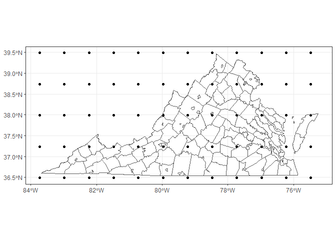

Check EAC4 data downloaded via web form
================

``` r
pacman::p_load(
    rio,            # import and export files
    here,           # locate files 
    tidyverse,      # data management and visualization
    chva.extras,
    sf,
    terra
)
```

# One variable

``` r
# 1 variable #------------------
data_web1 <- terra::rast(here("eac4/eac4_va_pm25_web.nc"))

data_web1
```

    ## class       : SpatRaster 
    ## size        : 5, 12, 6  (nrow, ncol, nlyr)
    ## resolution  : 0.75, 0.75  (x, y)
    ## extent      : -84.1, -75.1, 36.116, 39.866  (xmin, xmax, ymin, ymax)
    ## coord. ref. : lon/lat WGS 84 (CRS84) (OGC:CRS84) 
    ## source      : eac4_va_pm25_web.nc 
    ## varname     : pm2p5 (Particulate matter d <= 2.5 um) 
    ## names       : pm2p5~18800, pm2p5~29600, pm2p5~40400, pm2p5~05200, pm2p5~16000, pm2p5~26800 
    ## unit        : kg m**-3 
    ## depth       : 1609318800 to 1609426800 (valid_time [seconds since 1970-01-01]: 6 steps)

``` r
(times <- terra::time(data_web1))
```

    ## [1] NA NA NA NA NA NA

``` r
df_cleaned1 <- data_web1 %>% 
    terra::as.data.frame(xy = TRUE, time = TRUE) %>% 
    tidyr::pivot_longer(cols = c(-x, -y), names_to = "timeUTC", 
                        values_to = "value") %>% 
    mutate(timeUTC = str_match(timeUTC, "=(.*)")[,2],
           timeUTC = as.numeric(timeUTC),
           timeUTC = as_datetime(timeUTC, origin = lubridate::origin, tz = "UTC"),
           timeET = lubridate::ymd_hms(timeUTC, tz = "UTC"),
           timeET = lubridate::with_tz(timeET, "US/Eastern"), 
           .after = timeUTC) %>% 
    sf::st_as_sf(coords = c("x", "y"), crs = "WGS84")
df_cleaned1
```

    ## Simple feature collection with 360 features and 3 fields
    ## Geometry type: POINT
    ## Dimension:     XY
    ## Bounding box:  xmin: -83.725 ymin: 36.491 xmax: -75.475 ymax: 39.491
    ## Geodetic CRS:  WGS 84
    ## # A tibble: 360 × 4
    ##    timeUTC             timeET                      value         geometry
    ##  * <dttm>              <dttm>                      <dbl>      <POINT [°]>
    ##  1 2020-12-30 09:00:00 2020-12-30 04:00:00 0.00000000643 (-83.725 39.491)
    ##  2 2020-12-30 12:00:00 2020-12-30 07:00:00 0.00000000621 (-83.725 39.491)
    ##  3 2020-12-30 15:00:00 2020-12-30 10:00:00 0.00000000394 (-83.725 39.491)
    ##  4 2020-12-31 09:00:00 2020-12-31 04:00:00 0.00000000628 (-83.725 39.491)
    ##  5 2020-12-31 12:00:00 2020-12-31 07:00:00 0.0000000136  (-83.725 39.491)
    ##  6 2020-12-31 15:00:00 2020-12-31 10:00:00 0.0000000112  (-83.725 39.491)
    ##  7 2020-12-30 09:00:00 2020-12-30 04:00:00 0.00000000604 (-82.975 39.491)
    ##  8 2020-12-30 12:00:00 2020-12-30 07:00:00 0.00000000602 (-82.975 39.491)
    ##  9 2020-12-30 15:00:00 2020-12-30 10:00:00 0.00000000359 (-82.975 39.491)
    ## 10 2020-12-31 09:00:00 2020-12-31 04:00:00 0.00000000567 (-82.975 39.491)
    ## # ℹ 350 more rows

``` r
ggplot() +
    geom_sf(data = df_cleaned1,
            aes(geometry = geometry)) +
    geom_sf(data = chva.extras::sf_va_county,
            aes(geometry = geometry),
            fill = NA) +
    theme_bw()
```

<!-- -->

# Two variables

``` r
# 2 variables #------------------
data_web2 <- terra::rast(here("eac4/eac4_va_pm1_pm10_web.nc"))

data_web2
```

    ## class       : SpatRaster 
    ## size        : 5, 12, 18  (nrow, ncol, nlyr)
    ## resolution  : 0.75, 0.75  (x, y)
    ## extent      : -84.1, -75.1, 36.116, 39.866  (xmin, xmax, ymin, ymax)
    ## coord. ref. : lon/lat WGS 84 (CRS84) (OGC:CRS84) 
    ## sources     : eac4_va_pm1_pm10_web.nc:pm1  (9 layers) 
    ##               eac4_va_pm1_pm10_web.nc:pm10  (9 layers) 
    ## varnames    : pm1 (Particulate matter d <= 1 um) 
    ##               pm10 (Particulate matter d <= 10 um) 
    ## names       : pm1_v~26800, pm1_v~37600, pm1_v~48400, pm1_v~13200, pm1_v~24000, pm1_v~34800,      ... 
    ## unit        : kg m**-3 
    ## depth       : 1671526800 to 1671721200 (seconds since 1970-01-01 [seconds since 1970-01-01]: 9 steps)

``` r
terra::varnames(data_web2)
```

    ## [1] "pm1"  "pm10"

``` r
raster_pm1 <- subset(data_web2,
                     str_detect(names(data_web2), "pm1_"))
raster_pm1
```

    ## class       : SpatRaster 
    ## size        : 5, 12, 9  (nrow, ncol, nlyr)
    ## resolution  : 0.75, 0.75  (x, y)
    ## extent      : -84.1, -75.1, 36.116, 39.866  (xmin, xmax, ymin, ymax)
    ## coord. ref. : lon/lat WGS 84 (CRS84) (OGC:CRS84) 
    ## source      : eac4_va_pm1_pm10_web.nc:pm1 
    ## varname     : pm1 (Particulate matter d <= 1 um) 
    ## names       : pm1_v~26800, pm1_v~37600, pm1_v~48400, pm1_v~13200, pm1_v~24000, pm1_v~34800,      ... 
    ## unit        : kg m**-3 
    ## depth       : 1671526800 to 1671721200 (seconds since 1970-01-01 [seconds since 1970-01-01]: 9 steps)

``` r
raster_pm10 <- subset(data_web2,
                     str_detect(names(data_web2), "pm10_"))
raster_pm10
```

    ## class       : SpatRaster 
    ## size        : 5, 12, 9  (nrow, ncol, nlyr)
    ## resolution  : 0.75, 0.75  (x, y)
    ## extent      : -84.1, -75.1, 36.116, 39.866  (xmin, xmax, ymin, ymax)
    ## coord. ref. : lon/lat WGS 84 (CRS84) (OGC:CRS84) 
    ## source      : eac4_va_pm1_pm10_web.nc:pm10 
    ## varname     : pm10 (Particulate matter d <= 10 um) 
    ## names       : pm10_~26800, pm10_~37600, pm10_~48400, pm10_~13200, pm10_~24000, pm10_~34800,      ... 
    ## unit        : kg m**-3 
    ## depth       : 1671526800 to 1671721200 (seconds since 1970-01-01 [seconds since 1970-01-01]: 9 steps)

``` r
df_cleaned_pm10 <- raster_pm10 %>% 
    terra::as.data.frame(xy = TRUE, time = TRUE) %>% 
    tidyr::pivot_longer(cols = c(-x, -y), names_to = "timeUTC", 
                        values_to = "value") %>% 
    mutate(timeUTC = str_match(timeUTC, "=(.*)")[,2],
           timeUTC = as.numeric(timeUTC),
           timeUTC = as_datetime(timeUTC, origin = lubridate::origin, tz = "UTC"),
           timeET = lubridate::ymd_hms(timeUTC, tz = "UTC"),
           timeET = lubridate::with_tz(timeET, "US/Eastern"), 
           .after = timeUTC) %>% 
    sf::st_as_sf(coords = c("x", "y"), crs = "WGS84")
df_cleaned_pm10
```

    ## Simple feature collection with 540 features and 3 fields
    ## Geometry type: POINT
    ## Dimension:     XY
    ## Bounding box:  xmin: -83.725 ymin: 36.491 xmax: -75.475 ymax: 39.491
    ## Geodetic CRS:  WGS 84
    ## # A tibble: 540 × 4
    ##    timeUTC             timeET                      value         geometry
    ##  * <dttm>              <dttm>                      <dbl>      <POINT [°]>
    ##  1 2022-12-20 09:00:00 2022-12-20 04:00:00 0.0000000186  (-83.725 39.491)
    ##  2 2022-12-20 12:00:00 2022-12-20 07:00:00 0.0000000135  (-83.725 39.491)
    ##  3 2022-12-20 15:00:00 2022-12-20 10:00:00 0.0000000157  (-83.725 39.491)
    ##  4 2022-12-21 09:00:00 2022-12-21 04:00:00 0.0000000274  (-83.725 39.491)
    ##  5 2022-12-21 12:00:00 2022-12-21 07:00:00 0.00000000978 (-83.725 39.491)
    ##  6 2022-12-21 15:00:00 2022-12-21 10:00:00 0.00000000568 (-83.725 39.491)
    ##  7 2022-12-22 09:00:00 2022-12-22 04:00:00 0.00000000887 (-83.725 39.491)
    ##  8 2022-12-22 12:00:00 2022-12-22 07:00:00 0.00000000551 (-83.725 39.491)
    ##  9 2022-12-22 15:00:00 2022-12-22 10:00:00 0.00000000878 (-83.725 39.491)
    ## 10 2022-12-20 09:00:00 2022-12-20 04:00:00 0.0000000213  (-82.975 39.491)
    ## # ℹ 530 more rows

``` r
ggplot() +
    geom_sf(data = df_cleaned_pm10,
            aes(geometry = geometry)) +
    geom_sf(data = chva.extras::sf_va_county,
            aes(geometry = geometry),
            fill = NA) +
    theme_bw()
```

<!-- -->
