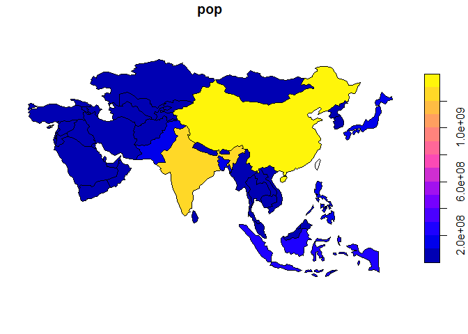
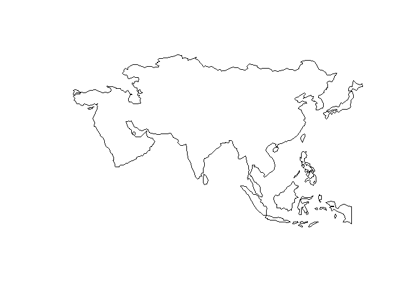
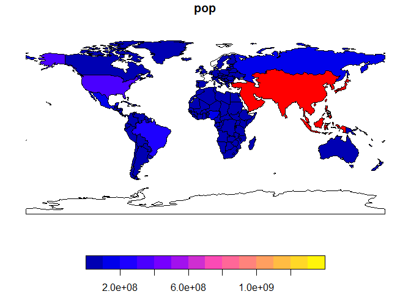
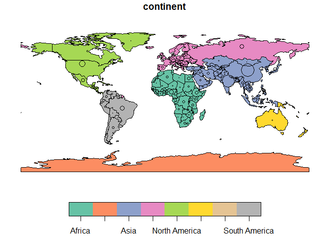
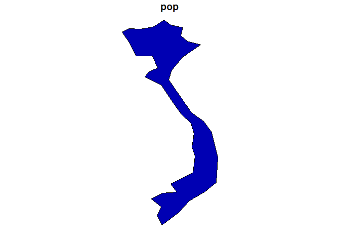
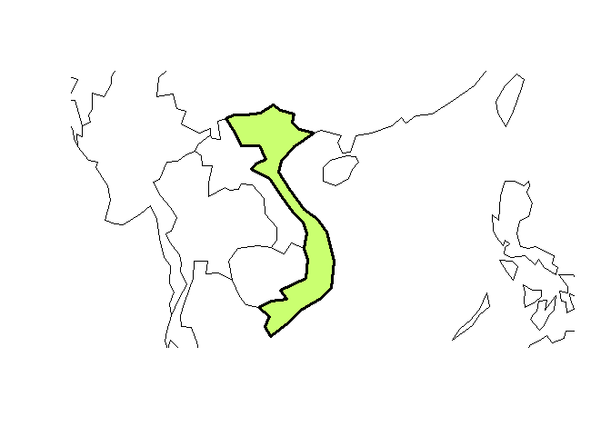
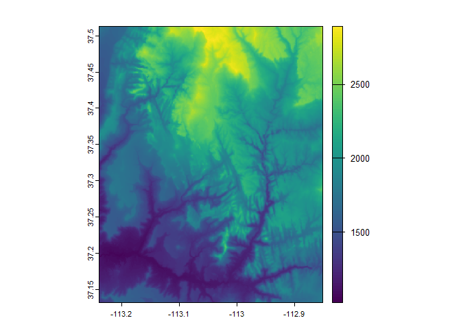

Chap02 - Geographic data
================

``` r
# install.packages("spDataLarge",
#                  repos = "https://geocompr.r-universe.dev")
pacman::p_load(
    rio,            # import and export files
    here,           # locate files 
    tidyverse,      # data management and visualization
    skimr,
    sf,             # classes and functions for vector data
    terra,          # classes and functions for raster data
    spData,         # load geographic data
    spDataLarge     # load larger geographic data
)
```

# Vector data

``` r
# vector data #---------------------
```

## `sf`: Simple feature

``` r
## sf #-----------
class(world)
```

    ## [1] "sf"         "tbl_df"     "tbl"        "data.frame"

``` r
names(world)
```

    ##  [1] "iso_a2"    "name_long" "continent" "region_un" "subregion" "type"      "area_km2" 
    ##  [8] "pop"       "lifeExp"   "gdpPercap" "geom"

``` r
world
```

    ## Simple feature collection with 177 features and 10 fields
    ## Geometry type: MULTIPOLYGON
    ## Dimension:     XY
    ## Bounding box:  xmin: -180 ymin: -89.9 xmax: 180 ymax: 83.64513
    ## Geodetic CRS:  WGS 84
    ## # A tibble: 177 × 11
    ##    iso_a2 name_long        continent  region_un subregion type  area_km2     pop lifeExp gdpPercap
    ##  * <chr>  <chr>            <chr>      <chr>     <chr>     <chr>    <dbl>   <dbl>   <dbl>     <dbl>
    ##  1 FJ     Fiji             Oceania    Oceania   Melanesia Sove…   1.93e4  8.86e5    70.0     8222.
    ##  2 TZ     Tanzania         Africa     Africa    Eastern … Sove…   9.33e5  5.22e7    64.2     2402.
    ##  3 EH     Western Sahara   Africa     Africa    Northern… Inde…   9.63e4 NA         NA         NA 
    ##  4 CA     Canada           North Ame… Americas  Northern… Sove…   1.00e7  3.55e7    82.0    43079.
    ##  5 US     United States    North Ame… Americas  Northern… Coun…   9.51e6  3.19e8    78.8    51922.
    ##  6 KZ     Kazakhstan       Asia       Asia      Central … Sove…   2.73e6  1.73e7    71.6    23587.
    ##  7 UZ     Uzbekistan       Asia       Asia      Central … Sove…   4.61e5  3.08e7    71.0     5371.
    ##  8 PG     Papua New Guinea Oceania    Oceania   Melanesia Sove…   4.65e5  7.76e6    65.2     3709.
    ##  9 ID     Indonesia        Asia       Asia      South-Ea… Sove…   1.82e6  2.55e8    68.9    10003.
    ## 10 AR     Argentina        South Ame… Americas  South Am… Sove…   2.78e6  4.30e7    76.3    18798.
    ## # ℹ 167 more rows
    ## # ℹ 1 more variable: geom <MULTIPOLYGON [°]>

``` r
plot(world)
```

    ## Warning: plotting the first 9 out of 10 attributes; use max.plot = 10 to plot all

<!-- -->

``` r
skimr::skim(world)
```

    ## Warning: Couldn't find skimmers for class: sfc_MULTIPOLYGON, sfc; No user-defined `sfl` provided.
    ## Falling back to `character`.

|                                                  |       |
|:-------------------------------------------------|:------|
| Name                                             | world |
| Number of rows                                   | 177   |
| Number of columns                                | 11    |
| \_\_\_\_\_\_\_\_\_\_\_\_\_\_\_\_\_\_\_\_\_\_\_   |       |
| Column type frequency:                           |       |
| character                                        | 7     |
| numeric                                          | 4     |
| \_\_\_\_\_\_\_\_\_\_\_\_\_\_\_\_\_\_\_\_\_\_\_\_ |       |
| Group variables                                  | None  |

Data summary

**Variable type: character**

| skim_variable | n_missing | complete_rate | min |   max | empty | n_unique | whitespace |
|:--------------|----------:|--------------:|----:|------:|------:|---------:|-----------:|
| iso_a2        |         2 |          0.99 |   2 |     2 |     0 |      175 |          0 |
| name_long     |         0 |          1.00 |   4 |    35 |     0 |      177 |          0 |
| continent     |         0 |          1.00 |   4 |    23 |     0 |        8 |          0 |
| region_un     |         0 |          1.00 |   4 |    23 |     0 |        7 |          0 |
| subregion     |         0 |          1.00 |   9 |    25 |     0 |       22 |          0 |
| type          |         0 |          1.00 |   7 |    17 |     0 |        5 |          0 |
| geom          |         0 |          1.00 | 135 | 24760 |     0 |      177 |          0 |

**Variable type: numeric**

| skim_variable | n_missing | complete_rate | mean | sd | p0 | p25 | p50 | p75 | p100 | hist |
|:---|---:|---:|---:|---:|---:|---:|---:|---:|---:|:---|
| area_km2 | 0 | 1.00 | 832558.33 | 2163425.48 | 2416.87 | 46185.25 | 185004.13 | 621860.35 | 1.701851e+07 | ▇▁▁▁▁ |
| pop | 10 | 0.94 | 42815798.06 | 149413217\.06 | 56295.00 | 3754725.00 | 10401062.00 | 30748039.00 | 1.364270e+09 | ▇▁▁▁▁ |
| lifeExp | 10 | 0.94 | 70.85 | 8.21 | 50.62 | 64.96 | 72.87 | 76.78 | 8.359000e+01 | ▂▃▅▇▅ |
| gdpPercap | 17 | 0.90 | 17105.99 | 18668.07 | 597.14 | 3752.37 | 10734.07 | 24232.74 | 1.208601e+05 | ▇▂▁▁▁ |

``` r
summary(world["lifeExp"])
```

    ##     lifeExp                 geom    
    ##  Min.   :50.62   MULTIPOLYGON :177  
    ##  1st Qu.:64.96   epsg:4326    :  0  
    ##  Median :72.87   +proj=long...:  0  
    ##  Mean   :70.85                      
    ##  3rd Qu.:76.78                      
    ##  Max.   :83.59                      
    ##  NA's   :10

``` r
world %>% 
    slice(1:2) %>% 
    select(1:3)
```

    ## Simple feature collection with 2 features and 3 fields
    ## Geometry type: MULTIPOLYGON
    ## Dimension:     XY
    ## Bounding box:  xmin: -180 ymin: -18.28799 xmax: 180 ymax: -0.95
    ## Geodetic CRS:  WGS 84
    ## # A tibble: 2 × 4
    ##   iso_a2 name_long continent                                                                  geom
    ##   <chr>  <chr>     <chr>                                                        <MULTIPOLYGON [°]>
    ## 1 FJ     Fiji      Oceania   (((-180 -16.55522, -179.9174 -16.50178, -179.7933 -16.02088, -180 -1…
    ## 2 TZ     Tanzania  Africa    (((33.90371 -0.95, 31.86617 -1.02736, 30.76986 -1.01455, 30.4191 -1.…

## Basic map

``` r
## basic map #-----------
plot(world[3:6])
```

<!-- -->

``` r
plot(world["pop"])
```

<!-- -->

Add layers to existing map

``` r
(world_asia <- world %>% filter(continent == "Asia"))
```

    ## Simple feature collection with 47 features and 10 fields
    ## Geometry type: MULTIPOLYGON
    ## Dimension:     XY
    ## Bounding box:  xmin: 26.04335 ymin: -10.35999 xmax: 145.5431 ymax: 55.38525
    ## Geodetic CRS:  WGS 84
    ## # A tibble: 47 × 11
    ##    iso_a2 name_long          continent region_un subregion type  area_km2    pop lifeExp gdpPercap
    ##  * <chr>  <chr>              <chr>     <chr>     <chr>     <chr>    <dbl>  <dbl>   <dbl>     <dbl>
    ##  1 KZ     Kazakhstan         Asia      Asia      Central … Sove… 2729811. 1.73e7    71.6    23587.
    ##  2 UZ     Uzbekistan         Asia      Asia      Central … Sove…  461410. 3.08e7    71.0     5371.
    ##  3 ID     Indonesia          Asia      Asia      South-Ea… Sove… 1819251. 2.55e8    68.9    10003.
    ##  4 TL     Timor-Leste        Asia      Asia      South-Ea… Sove…   14715. 1.21e6    68.3     6263.
    ##  5 IL     Israel             Asia      Asia      Western … Coun…   22991. 8.22e6    82.2    31702.
    ##  6 LB     Lebanon            Asia      Asia      Western … Sove…   10099. 5.60e6    79.2    13831.
    ##  7 PS     Palestine          Asia      Asia      Western … Disp…    5037. 4.29e6    73.1     4320.
    ##  8 JO     Jordan             Asia      Asia      Western … Sove…   89207. 8.81e6    74.0     8622.
    ##  9 AE     United Arab Emira… Asia      Asia      Western … Sove…   79881. 9.07e6    76.9    63943.
    ## 10 QA     Qatar              Asia      Asia      Western … Sove…   11328. 2.37e6    77.9   120860.
    ## # ℹ 37 more rows
    ## # ℹ 1 more variable: geom <MULTIPOLYGON [°]>

``` r
(asia <- st_union(world_asia))
```

    ## Geometry set for 1 feature 
    ## Geometry type: MULTIPOLYGON
    ## Dimension:     XY
    ## Bounding box:  xmin: 26.04335 ymin: -10.35999 xmax: 145.5431 ymax: 55.38525
    ## Geodetic CRS:  WGS 84

    ## MULTIPOLYGON (((36.14976 35.82153, 35.90502 35....

``` r
plot(world_asia["pop"])
```

<!-- -->

``` r
plot(asia)
```

<!-- -->

``` r
plot(world["pop"], reset = FALSE)
plot(asia, add = TRUE, col = "red")
```

<!-- -->

Add points to map

``` r
plot(world["continent"], reset = FALSE)

cex <- sqrt(world$pop) / 10000

(world_cents <- st_centroid(world, of_largest = TRUE))
```

    ## Warning: st_centroid assumes attributes are constant over geometries

    ## Simple feature collection with 177 features and 10 fields
    ## Geometry type: POINT
    ## Dimension:     XY
    ## Bounding box:  xmin: -103.5729 ymin: -84.96858 xmax: 178.5684 ymax: 73.15078
    ## Geodetic CRS:  WGS 84
    ## # A tibble: 177 × 11
    ##    iso_a2 name_long        continent  region_un subregion type  area_km2     pop lifeExp gdpPercap
    ##  * <chr>  <chr>            <chr>      <chr>     <chr>     <chr>    <dbl>   <dbl>   <dbl>     <dbl>
    ##  1 FJ     Fiji             Oceania    Oceania   Melanesia Sove…   1.93e4  8.86e5    70.0     8222.
    ##  2 TZ     Tanzania         Africa     Africa    Eastern … Sove…   9.33e5  5.22e7    64.2     2402.
    ##  3 EH     Western Sahara   Africa     Africa    Northern… Inde…   9.63e4 NA         NA         NA 
    ##  4 CA     Canada           North Ame… Americas  Northern… Sove…   1.00e7  3.55e7    82.0    43079.
    ##  5 US     United States    North Ame… Americas  Northern… Coun…   9.51e6  3.19e8    78.8    51922.
    ##  6 KZ     Kazakhstan       Asia       Asia      Central … Sove…   2.73e6  1.73e7    71.6    23587.
    ##  7 UZ     Uzbekistan       Asia       Asia      Central … Sove…   4.61e5  3.08e7    71.0     5371.
    ##  8 PG     Papua New Guinea Oceania    Oceania   Melanesia Sove…   4.65e5  7.76e6    65.2     3709.
    ##  9 ID     Indonesia        Asia       Asia      South-Ea… Sove…   1.82e6  2.55e8    68.9    10003.
    ## 10 AR     Argentina        South Ame… Americas  South Am… Sove…   2.78e6  4.30e7    76.3    18798.
    ## # ℹ 167 more rows
    ## # ℹ 1 more variable: geom <POINT [°]>

``` r
st_geometry(world_cents)
```

    ## Geometry set for 177 features 
    ## Geometry type: POINT
    ## Dimension:     XY
    ## Bounding box:  xmin: -103.5729 ymin: -84.96858 xmax: 178.5684 ymax: 73.15078
    ## Geodetic CRS:  WGS 84
    ## First 5 geometries:

    ## POINT (178.5684 -17.31562)

    ## POINT (34.74198 -6.250564)

    ## POINT (-12.18574 24.27838)

    ## POINT (-96.39551 60.47676)

    ## POINT (-103.5729 44.75598)

``` r
plot(st_geometry(world_cents), add = TRUE, cex = cex)
```

<!-- -->

Modify map

``` r
(vietnam <- world %>% filter(name_long == "Vietnam"))
```

    ## Simple feature collection with 1 feature and 10 fields
    ## Geometry type: MULTIPOLYGON
    ## Dimension:     XY
    ## Bounding box:  xmin: 102.1704 ymin: 8.59976 xmax: 109.3353 ymax: 23.35206
    ## Geodetic CRS:  WGS 84
    ## # A tibble: 1 × 11
    ##   iso_a2 name_long continent region_un subregion          type   area_km2    pop lifeExp gdpPercap
    ## * <chr>  <chr>     <chr>     <chr>     <chr>              <chr>     <dbl>  <dbl>   <dbl>     <dbl>
    ## 1 VN     Vietnam   Asia      Asia      South-Eastern Asia Sover…  335991. 9.25e7    75.9     5265.
    ## # ℹ 1 more variable: geom <MULTIPOLYGON [°]>

``` r
plot(vietnam["pop"])
```

<!-- -->

``` r
plot(st_geometry(vietnam),
     expandBB = c(0, 0.2, 0.1, 1),
     col = "darkolivegreen1",
     lwd = 3)
plot(st_geometry(world_asia), add = TRUE)
```

<!-- -->

# Raster data

``` r
# raster data #---------------------
```

## `terra::`

``` r
## terra #-------------
raster_filepath = system.file("raster/srtm.tif", package = "spDataLarge")

my_rast = rast(raster_filepath)

class(my_rast)
```

    ## [1] "SpatRaster"
    ## attr(,"package")
    ## [1] "terra"

``` r
my_rast
```

    ## class       : SpatRaster 
    ## size        : 457, 465, 1  (nrow, ncol, nlyr)
    ## resolution  : 0.0008333333, 0.0008333333  (x, y)
    ## extent      : -113.2396, -112.8521, 37.13208, 37.51292  (xmin, xmax, ymin, ymax)
    ## coord. ref. : lon/lat WGS 84 (EPSG:4326) 
    ## source      : srtm.tif 
    ## name        : srtm 
    ## min value   : 1024 
    ## max value   : 2892

``` r
# number of rows, columns and layers
dim(my_rast)
```

    ## [1] 457 465   1

``` r
# number of cells
ncell(my_rast)
```

    ## [1] 212505

``` r
# spatial resolution
res(my_rast)
```

    ## [1] 0.0008333333 0.0008333333

``` r
# spatial extent
ext(my_rast)
```

    ## SpatExtent : -113.239583212784, -112.85208321281, 37.1320834298579, 37.5129167631658 (xmin, xmax, ymin, ymax)

``` r
# CRS
crs(my_rast)
```

    ## [1] "GEOGCRS[\"WGS 84\",\n    ENSEMBLE[\"World Geodetic System 1984 ensemble\",\n        MEMBER[\"World Geodetic System 1984 (Transit)\"],\n        MEMBER[\"World Geodetic System 1984 (G730)\"],\n        MEMBER[\"World Geodetic System 1984 (G873)\"],\n        MEMBER[\"World Geodetic System 1984 (G1150)\"],\n        MEMBER[\"World Geodetic System 1984 (G1674)\"],\n        MEMBER[\"World Geodetic System 1984 (G1762)\"],\n        MEMBER[\"World Geodetic System 1984 (G2139)\"],\n        MEMBER[\"World Geodetic System 1984 (G2296)\"],\n        ELLIPSOID[\"WGS 84\",6378137,298.257223563,\n            LENGTHUNIT[\"metre\",1]],\n        ENSEMBLEACCURACY[2.0]],\n    PRIMEM[\"Greenwich\",0,\n        ANGLEUNIT[\"degree\",0.0174532925199433]],\n    CS[ellipsoidal,2],\n        AXIS[\"geodetic latitude (Lat)\",north,\n            ORDER[1],\n            ANGLEUNIT[\"degree\",0.0174532925199433]],\n        AXIS[\"geodetic longitude (Lon)\",east,\n            ORDER[2],\n            ANGLEUNIT[\"degree\",0.0174532925199433]],\n    USAGE[\n        SCOPE[\"Horizontal component of 3D system.\"],\n        AREA[\"World.\"],\n        BBOX[-90,-180,90,180]],\n    ID[\"EPSG\",4326]]"

``` r
# number of layers
nlyr(my_rast)
```

    ## [1] 1

``` r
# data location: in memory or on disk?
inMemory(my_rast)
```

    ## [1] FALSE

``` r
# data location
sources(my_rast)
```

    ## [1] "C:/Users/qus7tm/AppData/Local/R/win-library/4.5/spDataLarge/raster/srtm.tif"

## Basic map

``` r
## basic map #-----------
plot(my_rast)
```

<!-- -->

## Raster with multiple layers

``` r
## multi-layer #---------------
multi_raster_file = system.file("raster/landsat.tif", package = "spDataLarge")

multi_rast = rast(multi_raster_file)

multi_rast
```

    ## class       : SpatRaster 
    ## size        : 1428, 1128, 4  (nrow, ncol, nlyr)
    ## resolution  : 30, 30  (x, y)
    ## extent      : 301905, 335745, 4111245, 4154085  (xmin, xmax, ymin, ymax)
    ## coord. ref. : WGS 84 / UTM zone 12N (EPSG:32612) 
    ## source      : landsat.tif 
    ## names       : landsat_1, landsat_2, landsat_3, landsat_4 
    ## min values  :      7550,      6404,      5678,      5252 
    ## max values  :     19071,     22051,     25780,     31961

``` r
names(multi_rast)
```

    ## [1] "landsat_1" "landsat_2" "landsat_3" "landsat_4"

``` r
# select layer
multi_rast[[1]]
```

    ## class       : SpatRaster 
    ## size        : 1428, 1128, 1  (nrow, ncol, nlyr)
    ## resolution  : 30, 30  (x, y)
    ## extent      : 301905, 335745, 4111245, 4154085  (xmin, xmax, ymin, ymax)
    ## coord. ref. : WGS 84 / UTM zone 12N (EPSG:32612) 
    ## source      : landsat.tif 
    ## name        : landsat_1 
    ## min value   :      7550 
    ## max value   :     19071

``` r
multi_rast[["landsat_1"]]
```

    ## class       : SpatRaster 
    ## size        : 1428, 1128, 1  (nrow, ncol, nlyr)
    ## resolution  : 30, 30  (x, y)
    ## extent      : 301905, 335745, 4111245, 4154085  (xmin, xmax, ymin, ymax)
    ## coord. ref. : WGS 84 / UTM zone 12N (EPSG:32612) 
    ## source      : landsat.tif 
    ## name        : landsat_1 
    ## min value   :      7550 
    ## max value   :     19071

``` r
multi_rast$landsat_1
```

    ## class       : SpatRaster 
    ## size        : 1428, 1128, 1  (nrow, ncol, nlyr)
    ## resolution  : 30, 30  (x, y)
    ## extent      : 301905, 335745, 4111245, 4154085  (xmin, xmax, ymin, ymax)
    ## coord. ref. : WGS 84 / UTM zone 12N (EPSG:32612) 
    ## source      : landsat.tif 
    ## name        : landsat_1 
    ## min value   :      7550 
    ## max value   :     19071

``` r
subset(multi_rast, 1)
```

    ## class       : SpatRaster 
    ## size        : 1428, 1128, 1  (nrow, ncol, nlyr)
    ## resolution  : 30, 30  (x, y)
    ## extent      : 301905, 335745, 4111245, 4154085  (xmin, xmax, ymin, ymax)
    ## coord. ref. : WGS 84 / UTM zone 12N (EPSG:32612) 
    ## source      : landsat.tif 
    ## name        : landsat_1 
    ## min value   :      7550 
    ## max value   :     19071

``` r
subset(multi_rast, "landsat_1")
```

    ## class       : SpatRaster 
    ## size        : 1428, 1128, 1  (nrow, ncol, nlyr)
    ## resolution  : 30, 30  (x, y)
    ## extent      : 301905, 335745, 4111245, 4154085  (xmin, xmax, ymin, ymax)
    ## coord. ref. : WGS 84 / UTM zone 12N (EPSG:32612) 
    ## source      : landsat.tif 
    ## name        : landsat_1 
    ## min value   :      7550 
    ## max value   :     19071
