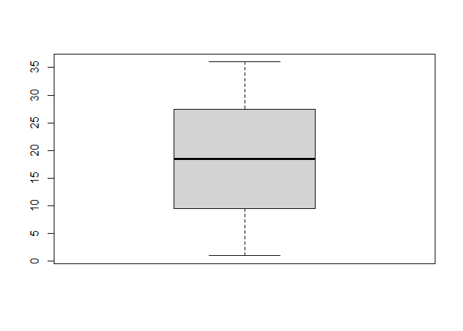
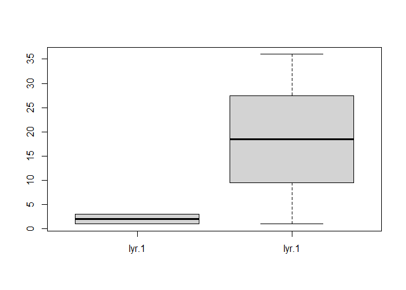
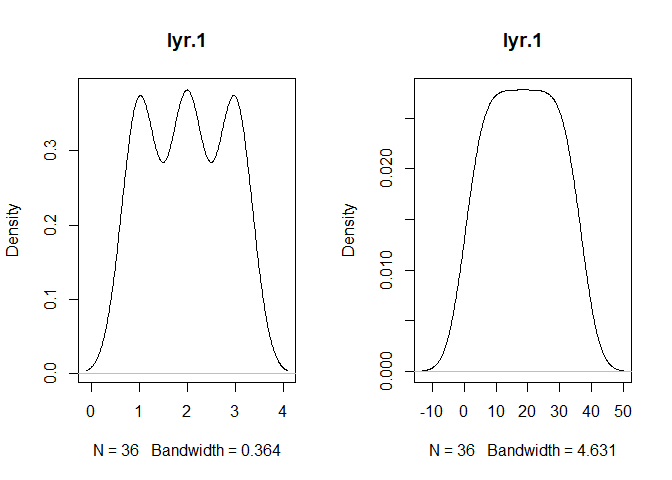
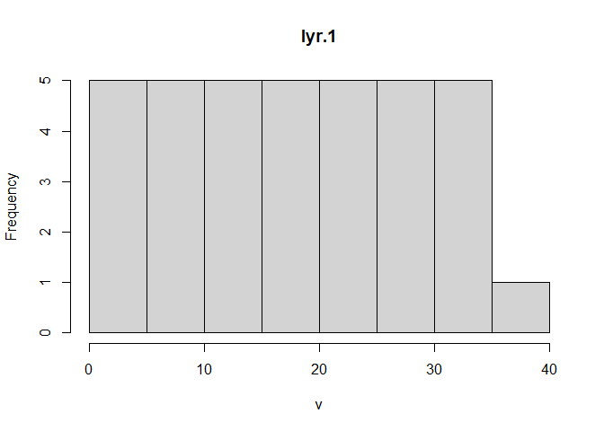
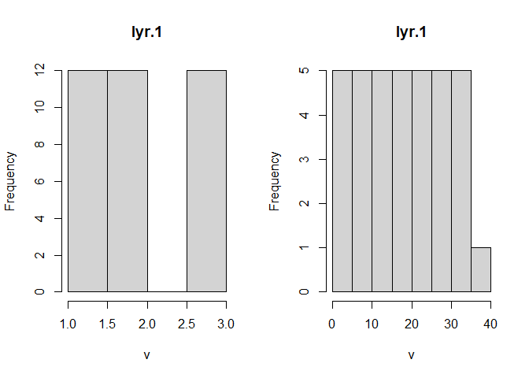

Chap03 - Attribute data operations
================

``` r
pacman::p_load(
    rio,            # import and export files
    here,           # locate files 
    tidyverse,      # data management and visualization
    skimr,
    sf,             # classes and functions for vector data
    terra,          # classes and functions for raster data
    spData,         # load geographic data
    spDataLarge     # load larger geographic data
)
```

# Vector data

``` r
# vector data #-----------
methods(class = "sf")
```

    ##   [1] $<-                          [                            [[<-                        
    ##   [4] [<-                          aggregate                    anti_join                   
    ##   [7] arrange                      as.data.frame                cbind                       
    ##  [10] coerce                       crs                          dbDataType                  
    ##  [13] dbWriteTable                 distance                     distinct                    
    ##  [16] dplyr_reconstruct            drop_na                      duplicated                  
    ##  [19] ext                          extract                      filter                      
    ##  [22] full_join                    gather                       group_by                    
    ##  [25] group_split                  identify                     initialize                  
    ##  [28] inner_join                   left_join                    lines                       
    ##  [31] mask                         merge                        mutate                      
    ##  [34] nest                         pivot_longer                 pivot_wider                 
    ##  [37] plot                         points                       polys                       
    ##  [40] print                        rasterize                    rbind                       
    ##  [43] rename                       rename_with                  right_join                  
    ##  [46] rowwise                      sample_frac                  sample_n                    
    ##  [49] select                       semi_join                    separate                    
    ##  [52] separate_rows                show                         slice                       
    ##  [55] slotsFromS3                  spread                       st_agr                      
    ##  [58] st_agr<-                     st_area                      st_as_s2                    
    ##  [61] st_as_sf                     st_as_sfc                    st_bbox                     
    ##  [64] st_boundary                  st_break_antimeridian        st_buffer                   
    ##  [67] st_cast                      st_centroid                  st_collection_extract       
    ##  [70] st_concave_hull              st_convex_hull               st_coordinates              
    ##  [73] st_crop                      st_crs                       st_crs<-                    
    ##  [76] st_difference                st_drop_geometry             st_exterior_ring            
    ##  [79] st_filter                    st_geometry                  st_geometry<-               
    ##  [82] st_inscribed_circle          st_interpolate_aw            st_intersection             
    ##  [85] st_intersects                st_is                        st_is_full                  
    ##  [88] st_is_valid                  st_join                      st_line_merge               
    ##  [91] st_m_range                   st_make_valid                st_minimum_bounding_circle  
    ##  [94] st_minimum_rotated_rectangle st_nearest_points            st_node                     
    ##  [97] st_normalize                 st_point_on_surface          st_polygonize               
    ## [100] st_precision                 st_reverse                   st_sample                   
    ## [103] st_segmentize                st_set_precision             st_shift_longitude          
    ## [106] st_simplify                  st_snap                      st_sym_difference           
    ## [109] st_transform                 st_triangulate               st_triangulate_constrained  
    ## [112] st_union                     st_voronoi                   st_wrap_dateline            
    ## [115] st_write                     st_z_range                   st_zm                       
    ## [118] summarise                    svc                          text                        
    ## [121] transform                    transmute                    ungroup                     
    ## [124] unite                        unnest                       vect                        
    ## see '?methods' for accessing help and source code

# Raster data

``` r
# raster data #-----------
# create elevation raster data: numeric values
elev = rast(nrows = 6, ncols = 6,
            xmin = -1.5, xmax = 1.5, ymin = -1.5, ymax = 1.5,
            vals = 1:36)

elev
```

    ## class       : SpatRaster 
    ## size        : 6, 6, 1  (nrow, ncol, nlyr)
    ## resolution  : 0.5, 0.5  (x, y)
    ## extent      : -1.5, 1.5, -1.5, 1.5  (xmin, xmax, ymin, ymax)
    ## coord. ref. : lon/lat WGS 84 (CRS84) (OGC:CRS84) 
    ## source(s)   : memory
    ## name        : lyr.1 
    ## min value   :     1 
    ## max value   :    36

``` r
# create grain raster data: categorical values
grain_order = c("clay", "silt", "sand")
grain_char = sample(grain_order, 36, replace = TRUE)
grain_fact = factor(grain_char, levels = grain_order)
grain = rast(nrows = 6, ncols = 6, 
             xmin = -1.5, xmax = 1.5, ymin = -1.5, ymax = 1.5,
             vals = grain_fact)

grain
```

    ## class       : SpatRaster 
    ## size        : 6, 6, 1  (nrow, ncol, nlyr)
    ## resolution  : 0.5, 0.5  (x, y)
    ## extent      : -1.5, 1.5, -1.5, 1.5  (xmin, xmax, ymin, ymax)
    ## coord. ref. : lon/lat WGS 84 (CRS84) (OGC:CRS84) 
    ## source(s)   : memory
    ## categories  : label 
    ## name        : lyr.1 
    ## min value   :  clay 
    ## max value   :  sand

``` r
## subset data #-----------
# row 1, column 1
elev[1, 1]
```

    ##   lyr.1
    ## 1     1

``` r
# cell ID 1
elev[1]
```

    ##   lyr.1
    ## 1     1

``` r
# multi-layered raster object
two_layers <- c(grain, elev)
two_layers[1]
```

    ##   lyr.1 lyr.1
    ## 1  clay     1

``` r
# extract all values
values(elev)
```

    ##       lyr.1
    ##  [1,]     1
    ##  [2,]     2
    ##  [3,]     3
    ##  [4,]     4
    ##  [5,]     5
    ##  [6,]     6
    ##  [7,]     7
    ##  [8,]     8
    ##  [9,]     9
    ## [10,]    10
    ## [11,]    11
    ## [12,]    12
    ## [13,]    13
    ## [14,]    14
    ## [15,]    15
    ## [16,]    16
    ## [17,]    17
    ## [18,]    18
    ## [19,]    19
    ## [20,]    20
    ## [21,]    21
    ## [22,]    22
    ## [23,]    23
    ## [24,]    24
    ## [25,]    25
    ## [26,]    26
    ## [27,]    27
    ## [28,]    28
    ## [29,]    29
    ## [30,]    30
    ## [31,]    31
    ## [32,]    32
    ## [33,]    33
    ## [34,]    34
    ## [35,]    35
    ## [36,]    36

``` r
values(two_layers)
```

    ##       lyr.1 lyr.1
    ##  [1,]     1     1
    ##  [2,]     3     2
    ##  [3,]     1     3
    ##  [4,]     1     4
    ##  [5,]     2     5
    ##  [6,]     2     6
    ##  [7,]     2     7
    ##  [8,]     3     8
    ##  [9,]     1     9
    ## [10,]     3    10
    ## [11,]     3    11
    ## [12,]     2    12
    ## [13,]     2    13
    ## [14,]     1    14
    ## [15,]     3    15
    ## [16,]     3    16
    ## [17,]     2    17
    ## [18,]     2    18
    ## [19,]     1    19
    ## [20,]     2    20
    ## [21,]     1    21
    ## [22,]     3    22
    ## [23,]     1    23
    ## [24,]     3    24
    ## [25,]     1    25
    ## [26,]     3    26
    ## [27,]     2    27
    ## [28,]     1    28
    ## [29,]     1    29
    ## [30,]     3    30
    ## [31,]     1    31
    ## [32,]     2    32
    ## [33,]     3    33
    ## [34,]     2    34
    ## [35,]     3    35
    ## [36,]     2    36

``` r
elev[]
```

    ##       lyr.1
    ##  [1,]     1
    ##  [2,]     2
    ##  [3,]     3
    ##  [4,]     4
    ##  [5,]     5
    ##  [6,]     6
    ##  [7,]     7
    ##  [8,]     8
    ##  [9,]     9
    ## [10,]    10
    ## [11,]    11
    ## [12,]    12
    ## [13,]    13
    ## [14,]    14
    ## [15,]    15
    ## [16,]    16
    ## [17,]    17
    ## [18,]    18
    ## [19,]    19
    ## [20,]    20
    ## [21,]    21
    ## [22,]    22
    ## [23,]    23
    ## [24,]    24
    ## [25,]    25
    ## [26,]    26
    ## [27,]    27
    ## [28,]    28
    ## [29,]    29
    ## [30,]    30
    ## [31,]    31
    ## [32,]    32
    ## [33,]    33
    ## [34,]    34
    ## [35,]    35
    ## [36,]    36

``` r
## summarize data #--------
summary(elev)
```

    ##      lyr.1      
    ##  Min.   : 1.00  
    ##  1st Qu.: 9.75  
    ##  Median :18.50  
    ##  Mean   :18.50  
    ##  3rd Qu.:27.25  
    ##  Max.   :36.00

``` r
summary(two_layers)
```

    ##   lyr.1       lyr.1.1     
    ##  clay:12   Min.   : 1.00  
    ##  silt:12   1st Qu.: 9.75  
    ##  sand:12   Median :18.50  
    ##            Mean   :18.50  
    ##            3rd Qu.:27.25  
    ##            Max.   :36.00

``` r
terra::global(elev)
```

    ##       mean
    ## lyr.1 18.5

``` r
terra::global(elev, sd)
```

    ##             sd
    ## lyr.1 10.53565

``` r
terra::global(two_layers)
```

    ##         mean
    ## lyr.1    2.0
    ## lyr.1.1 18.5

``` r
terra::freq(grain)
```

    ##   layer value count
    ## 1     1  clay    12
    ## 2     1  silt    12
    ## 3     1  sand    12

``` r
terra::freq(elev)
```

    ##    layer value count
    ## 1      1     1     1
    ## 2      1     2     1
    ## 3      1     3     1
    ## 4      1     4     1
    ## 5      1     5     1
    ## 6      1     6     1
    ## 7      1     7     1
    ## 8      1     8     1
    ## 9      1     9     1
    ## 10     1    10     1
    ## 11     1    11     1
    ## 12     1    12     1
    ## 13     1    13     1
    ## 14     1    14     1
    ## 15     1    15     1
    ## 16     1    16     1
    ## 17     1    17     1
    ## 18     1    18     1
    ## 19     1    19     1
    ## 20     1    20     1
    ## 21     1    21     1
    ## 22     1    22     1
    ## 23     1    23     1
    ## 24     1    24     1
    ## 25     1    25     1
    ## 26     1    26     1
    ## 27     1    27     1
    ## 28     1    28     1
    ## 29     1    29     1
    ## 30     1    30     1
    ## 31     1    31     1
    ## 32     1    32     1
    ## 33     1    33     1
    ## 34     1    34     1
    ## 35     1    35     1
    ## 36     1    36     1

``` r
terra::freq(two_layers)
```

    ##    layer value count
    ## 1      1  clay    12
    ## 2      1  silt    12
    ## 3      1  sand    12
    ## 4      2     1     1
    ## 5      2     2     1
    ## 6      2     3     1
    ## 7      2     4     1
    ## 8      2     5     1
    ## 9      2     6     1
    ## 10     2     7     1
    ## 11     2     8     1
    ## 12     2     9     1
    ## 13     2    10     1
    ## 14     2    11     1
    ## 15     2    12     1
    ## 16     2    13     1
    ## 17     2    14     1
    ## 18     2    15     1
    ## 19     2    16     1
    ## 20     2    17     1
    ## 21     2    18     1
    ## 22     2    19     1
    ## 23     2    20     1
    ## 24     2    21     1
    ## 25     2    22     1
    ## 26     2    23     1
    ## 27     2    24     1
    ## 28     2    25     1
    ## 29     2    26     1
    ## 30     2    27     1
    ## 31     2    28     1
    ## 32     2    29     1
    ## 33     2    30     1
    ## 34     2    31     1
    ## 35     2    32     1
    ## 36     2    33     1
    ## 37     2    34     1
    ## 38     2    35     1
    ## 39     2    36     1

``` r
## quick plot #-------------
boxplot(elev)
```

<!-- -->

``` r
boxplot(two_layers)
```

<!-- -->

``` r
density(elev)
```

<!-- -->

``` r
density(two_layers)
```

<!-- -->

``` r
hist(elev)
```

<!-- -->

``` r
hist(two_layers)
```

<!-- -->

``` r
pairs(two_layers)
```

<!-- -->
