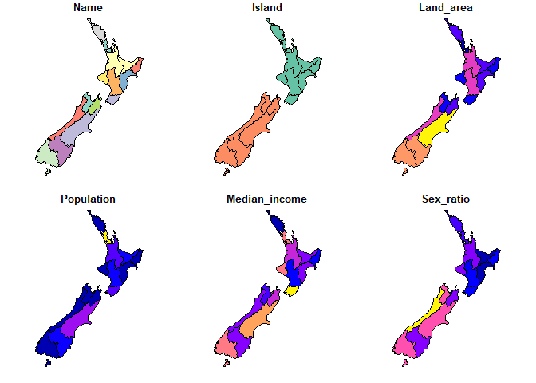
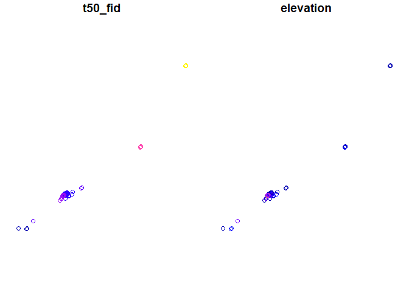
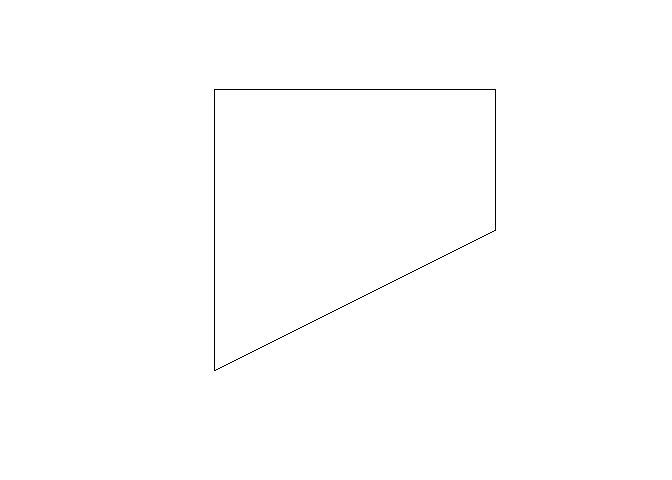
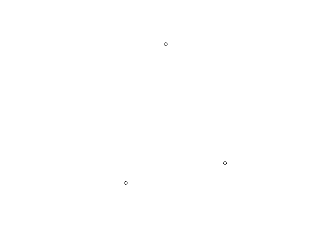
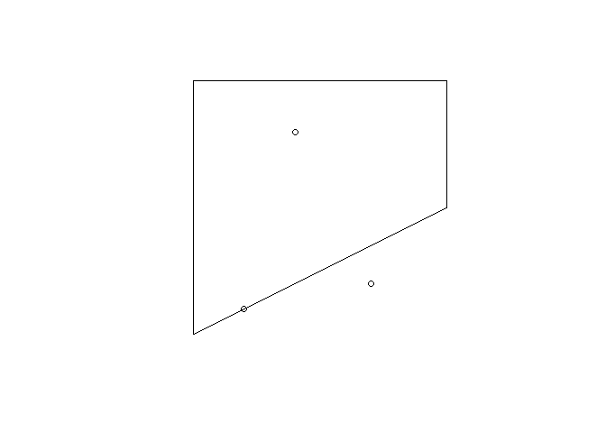
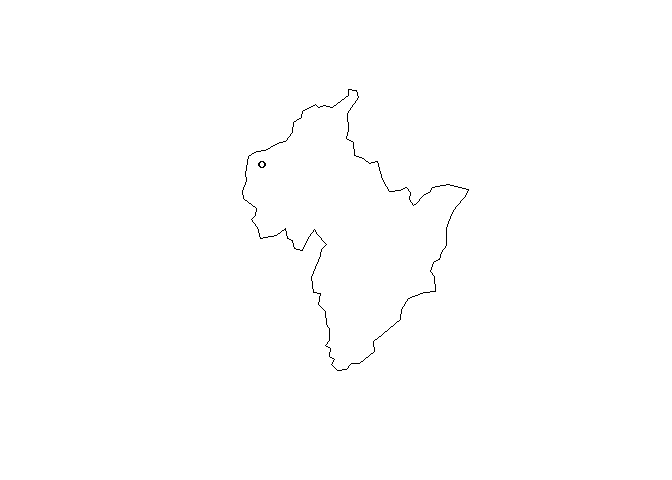
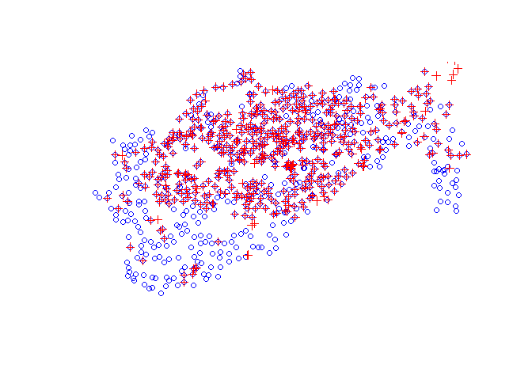
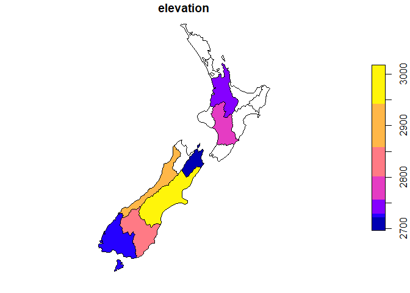

Chap04 - Spatial data operations
================

``` r
pacman::p_load(
    rio,            # import and export files
    here,           # locate files 
    tidyverse,      # data management and visualization
    skimr,
    sf,             # classes and functions for vector data
    terra,          # classes and functions for raster data
    spData,         # load geographic data
    spDataLarge     # load larger geographic data
)
```

# Vector data

``` r
# vector data #-----------
```

## Subset data

``` r
## subset data #--------------------
nz
```

    ## Simple feature collection with 16 features and 6 fields
    ## Geometry type: MULTIPOLYGON
    ## Dimension:     XY
    ## Bounding box:  xmin: 1090144 ymin: 4748537 xmax: 2089533 ymax: 6191874
    ## Projected CRS: NZGD2000 / New Zealand Transverse Mercator 2000
    ## First 10 features:
    ##                 Name Island Land_area Population Median_income Sex_ratio                           geom
    ## 1          Northland  North 12500.561     175500         23400 0.9424532 MULTIPOLYGON (((1745493 600...
    ## 2           Auckland  North  4941.573    1657200         29600 0.9442858 MULTIPOLYGON (((1803822 590...
    ## 3            Waikato  North 23900.036     460100         27900 0.9520500 MULTIPOLYGON (((1860345 585...
    ## 4      Bay of Plenty  North 12071.145     299900         26200 0.9280391 MULTIPOLYGON (((2049387 583...
    ## 5           Gisborne  North  8385.827      48500         24400 0.9349734 MULTIPOLYGON (((2024489 567...
    ## 6        Hawke's Bay  North 14137.524     164000         26100 0.9238375 MULTIPOLYGON (((2024489 567...
    ## 7           Taranaki  North  7254.480     118000         29100 0.9569363 MULTIPOLYGON (((1740438 571...
    ## 8  Manawatu-Wanganui  North 22220.608     234500         25000 0.9387734 MULTIPOLYGON (((1866732 566...
    ## 9         Wellington  North  8048.553     513900         32700 0.9335524 MULTIPOLYGON (((1881590 548...
    ## 10        West Coast  South 23245.456      32400         26900 1.0139072 MULTIPOLYGON (((1557042 531...

``` r
plot(nz)
```

<!-- -->

``` r
nz_height
```

    ## Simple feature collection with 101 features and 2 fields
    ## Geometry type: POINT
    ## Dimension:     XY
    ## Bounding box:  xmin: 1204143 ymin: 5048309 xmax: 1822492 ymax: 5650492
    ## Projected CRS: NZGD2000 / New Zealand Transverse Mercator 2000
    ## First 10 features:
    ##    t50_fid elevation                geometry
    ## 1  2353944      2723 POINT (1204143 5049971)
    ## 2  2354404      2820 POINT (1234725 5048309)
    ## 3  2354405      2830 POINT (1235915 5048745)
    ## 4  2369113      3033 POINT (1259702 5076570)
    ## 5  2362630      2749 POINT (1378170 5158491)
    ## 6  2362814      2822 POINT (1389460 5168749)
    ## 7  2362817      2778 POINT (1390166 5169466)
    ## 8  2363991      3004 POINT (1372357 5172729)
    ## 9  2363993      3114 POINT (1372062 5173236)
    ## 10 2363994      2882 POINT (1372810 5173419)

``` r
plot(nz_height)
```

<!-- -->

``` r
# option 1
(canterbury <- nz |> filter(Name == "Canterbury"))
```

    ## Simple feature collection with 1 feature and 6 fields
    ## Geometry type: MULTIPOLYGON
    ## Dimension:     XY
    ## Bounding box:  xmin: 1325039 ymin: 5004766 xmax: 1686902 ymax: 5360239
    ## Projected CRS: NZGD2000 / New Zealand Transverse Mercator 2000
    ##         Name Island Land_area Population Median_income Sex_ratio                           geom
    ## 1 Canterbury  South   44504.5     612000         30100 0.9753265 MULTIPOLYGON (((1686902 535...

``` r
(canterbury_height <- nz_height[canterbury, ])
```

    ## Simple feature collection with 70 features and 2 fields
    ## Geometry type: POINT
    ## Dimension:     XY
    ## Bounding box:  xmin: 1365809 ymin: 5158491 xmax: 1654899 ymax: 5350463
    ## Projected CRS: NZGD2000 / New Zealand Transverse Mercator 2000
    ## First 10 features:
    ##    t50_fid elevation                geometry
    ## 5  2362630      2749 POINT (1378170 5158491)
    ## 6  2362814      2822 POINT (1389460 5168749)
    ## 7  2362817      2778 POINT (1390166 5169466)
    ## 8  2363991      3004 POINT (1372357 5172729)
    ## 9  2363993      3114 POINT (1372062 5173236)
    ## 10 2363994      2882 POINT (1372810 5173419)
    ## 11 2363995      2796 POINT (1372579 5173989)
    ## 13 2363997      3070 POINT (1373796 5174144)
    ## 14 2363998      3061 POINT (1373955 5174231)
    ## 15 2363999      3077 POINT (1373984 5175228)

``` r
# option 2
(sel_sgbp <- st_intersects(x = nz_height, y = canterbury))
```

    ## Sparse geometry binary predicate list of length 101, where the predicate was `intersects'
    ## first 10 elements:
    ##  1: (empty)
    ##  2: (empty)
    ##  3: (empty)
    ##  4: (empty)
    ##  5: 1
    ##  6: 1
    ##  7: 1
    ##  8: 1
    ##  9: 1
    ##  10: 1

``` r
class(sel_sgbp)
```

    ## [1] "sgbp" "list"

``` r
(sel_logical <- lengths(sel_sgbp) > 0)
```

    ##   [1] FALSE FALSE FALSE FALSE  TRUE  TRUE  TRUE  TRUE  TRUE  TRUE  TRUE FALSE  TRUE  TRUE  TRUE  TRUE  TRUE
    ##  [18]  TRUE  TRUE  TRUE  TRUE  TRUE  TRUE  TRUE FALSE FALSE FALSE  TRUE  TRUE  TRUE  TRUE  TRUE  TRUE  TRUE
    ##  [35]  TRUE  TRUE  TRUE  TRUE  TRUE  TRUE  TRUE  TRUE  TRUE  TRUE  TRUE FALSE FALSE FALSE FALSE FALSE FALSE
    ##  [52] FALSE FALSE FALSE FALSE FALSE FALSE  TRUE  TRUE  TRUE  TRUE  TRUE  TRUE  TRUE  TRUE  TRUE FALSE  TRUE
    ##  [69]  TRUE  TRUE  TRUE  TRUE FALSE  TRUE  TRUE  TRUE  TRUE  TRUE  TRUE FALSE  TRUE FALSE FALSE  TRUE  TRUE
    ##  [86]  TRUE  TRUE  TRUE  TRUE  TRUE  TRUE  TRUE  TRUE  TRUE  TRUE FALSE FALSE FALSE FALSE FALSE FALSE

``` r
(canterbury_height2 <- nz_height[sel_logical, ])
```

    ## Simple feature collection with 70 features and 2 fields
    ## Geometry type: POINT
    ## Dimension:     XY
    ## Bounding box:  xmin: 1365809 ymin: 5158491 xmax: 1654899 ymax: 5350463
    ## Projected CRS: NZGD2000 / New Zealand Transverse Mercator 2000
    ## First 10 features:
    ##    t50_fid elevation                geometry
    ## 5  2362630      2749 POINT (1378170 5158491)
    ## 6  2362814      2822 POINT (1389460 5168749)
    ## 7  2362817      2778 POINT (1390166 5169466)
    ## 8  2363991      3004 POINT (1372357 5172729)
    ## 9  2363993      3114 POINT (1372062 5173236)
    ## 10 2363994      2882 POINT (1372810 5173419)
    ## 11 2363995      2796 POINT (1372579 5173989)
    ## 13 2363997      3070 POINT (1373796 5174144)
    ## 14 2363998      3061 POINT (1373955 5174231)
    ## 15 2363999      3077 POINT (1373984 5175228)

``` r
# option 3
(canterbury_height3 <- nz_height %>% 
    st_filter(y = canterbury,
              .predicate = st_intersects))
```

    ## Simple feature collection with 70 features and 2 fields
    ## Geometry type: POINT
    ## Dimension:     XY
    ## Bounding box:  xmin: 1365809 ymin: 5158491 xmax: 1654899 ymax: 5350463
    ## Projected CRS: NZGD2000 / New Zealand Transverse Mercator 2000
    ## First 10 features:
    ##    t50_fid elevation                geometry
    ## 1  2362630      2749 POINT (1378170 5158491)
    ## 2  2362814      2822 POINT (1389460 5168749)
    ## 3  2362817      2778 POINT (1390166 5169466)
    ## 4  2363991      3004 POINT (1372357 5172729)
    ## 5  2363993      3114 POINT (1372062 5173236)
    ## 6  2363994      2882 POINT (1372810 5173419)
    ## 7  2363995      2796 POINT (1372579 5173989)
    ## 8  2363997      3070 POINT (1373796 5174144)
    ## 9  2363998      3061 POINT (1373955 5174231)
    ## 10 2363999      3077 POINT (1373984 5175228)

## Topological relations

``` r
## topological relations #---------------------
# create polygon_sfc
polygon_matrix = cbind(
    x = c(0, 0, 1, 1,   0),
    y = c(0, 1, 1, 0.5, 0))
polygon_sfc = st_sfc(st_polygon(list(polygon_matrix)))
polygon_sfc
```

    ## Geometry set for 1 feature 
    ## Geometry type: POLYGON
    ## Dimension:     XY
    ## Bounding box:  xmin: 0 ymin: 0 xmax: 1 ymax: 1
    ## CRS:           NA

    ## POLYGON ((0 0, 0 1, 1 1, 1 0.5, 0 0))

``` r
plot(polygon_sfc)
```

<!-- -->

``` r
# create point_sf
point_df = data.frame(
    x = c(0.2, 0.7, 0.4),
    y = c(0.1, 0.2, 0.8))
point_sf = st_as_sf(point_df, coords = c("x", "y"))
point_sf
```

    ## Simple feature collection with 3 features and 0 fields
    ## Geometry type: POINT
    ## Dimension:     XY
    ## Bounding box:  xmin: 0.2 ymin: 0.1 xmax: 0.7 ymax: 0.8
    ## CRS:           NA
    ##          geometry
    ## 1 POINT (0.2 0.1)
    ## 2 POINT (0.7 0.2)
    ## 3 POINT (0.4 0.8)

``` r
plot(point_sf)
```

<!-- -->

``` r
# plot 2 sf
plot(polygon_sfc)
plot(point_sf, add = TRUE)
```

<!-- -->

Which of the points in `point_sf` intersect in some way with polygon
`polygon_sfc`?

``` r
st_intersects(point_sf, polygon_sfc)
```

    ## Sparse geometry binary predicate list of length 3, where the predicate was `intersects'
    ##  1: 1
    ##  2: (empty)
    ##  3: 1

``` r
st_intersects(point_sf, polygon_sfc, sparse = FALSE)
```

    ##       [,1]
    ## [1,]  TRUE
    ## [2,] FALSE
    ## [3,]  TRUE

Which points lie within the polygon?

``` r
st_within(point_sf, polygon_sfc)
```

    ## Sparse geometry binary predicate list of length 3, where the predicate was `within'
    ##  1: (empty)
    ##  2: (empty)
    ##  3: 1

Which features are on or contain a shared boundary with y?

``` r
st_touches(point_sf, polygon_sfc)
```

    ## Sparse geometry binary predicate list of length 3, where the predicate was `touches'
    ##  1: 1
    ##  2: (empty)
    ##  3: (empty)

objects that do not spatially relate in any way to the selecting object

``` r
st_disjoint(point_sf, polygon_sfc)
```

    ## Sparse geometry binary predicate list of length 3, where the predicate was `disjoint'
    ##  1: (empty)
    ##  2: 1
    ##  3: (empty)

``` r
st_disjoint(point_sf, polygon_sfc, sparse = FALSE)[, 1]
```

    ## [1] FALSE  TRUE FALSE

Features that `almost touch` the selection object

``` r
st_is_within_distance(point_sf, polygon_sfc, dist = 0.2, sparse = FALSE)[, 1]
```

    ## [1] TRUE TRUE TRUE

``` r
st_is_within_distance(point_sf, polygon_sfc, dist = 0.1, sparse = FALSE)[, 1]
```

    ## [1]  TRUE FALSE  TRUE

## Distance relations

``` r
## distance relations #---------------------
st_distance(point_sf, polygon_sfc)
```

    ##           [,1]
    ## [1,] 0.0000000
    ## [2,] 0.1341641
    ## [3,] 0.0000000

Distances between the first three features in nz_height and the Otago
and Canterbury regions of New Zealand

``` r
(co <- filter(nz, grepl("Canter|Otag", Name)))
```

    ## Simple feature collection with 2 features and 6 fields
    ## Geometry type: MULTIPOLYGON
    ## Dimension:     XY
    ## Bounding box:  xmin: 1214300 ymin: 4830067 xmax: 1686902 ymax: 5360239
    ## Projected CRS: NZGD2000 / New Zealand Transverse Mercator 2000
    ##         Name Island Land_area Population Median_income Sex_ratio                           geom
    ## 1 Canterbury  South  44504.50     612000         30100 0.9753265 MULTIPOLYGON (((1686902 535...
    ## 2      Otago  South  31186.31     224200         26300 0.9511694 MULTIPOLYGON (((1335205 512...

``` r
st_distance(nz_height[1:3, ], co)
```

    ## Units: [m]
    ##           [,1]     [,2]
    ## [1,] 123537.16 15497.72
    ## [2,]  94282.77     0.00
    ## [3,]  93018.56     0.00

The second and third points are **in Otago** → `distance = 0`

``` r
plot(st_geometry(co)[2])
plot(st_geometry(nz_height)[2:3], add = TRUE)
```

<!-- -->

## Distance-based joins

``` r
## distance-based joins #---------------------
```

Join objects: closely related but NOT touch

``` r
plot(st_geometry(cycle_hire), col = "blue")
plot(st_geometry(cycle_hire_osm), add = TRUE, pch = 3, col = "red")
```

<!-- -->

``` r
any(st_intersects(cycle_hire, cycle_hire_osm, sparse = FALSE))
```

    ## [1] FALSE

``` r
(sel <- st_is_within_distance(cycle_hire, cycle_hire_osm, 
                            dist = units::set_units(20, "m")))
```

    ## Sparse geometry binary predicate list of length 742, where the predicate was `is_within_distance'
    ## first 10 elements:
    ##  1: 233
    ##  2: 278
    ##  3: 294
    ##  4: 5
    ##  5: (empty)
    ##  6: 59
    ##  7: 68
    ##  8: 63
    ##  9: 23
    ##  10: 100

``` r
summary(lengths(sel) > 0)
```

    ##    Mode   FALSE    TRUE 
    ## logical     304     438

## Spatial aggregation

``` r
## spatial aggregation #--------------------
(nz_agg <- aggregate(x = nz_height, by = nz, FUN = mean))
```

    ## Simple feature collection with 16 features and 2 fields
    ## Geometry type: MULTIPOLYGON
    ## Dimension:     XY
    ## Bounding box:  xmin: 1090144 ymin: 4748537 xmax: 2089533 ymax: 6191874
    ## Projected CRS: NZGD2000 / New Zealand Transverse Mercator 2000
    ## First 10 features:
    ##    t50_fid elevation                       geometry
    ## 1       NA        NA MULTIPOLYGON (((1745493 600...
    ## 2       NA        NA MULTIPOLYGON (((1803822 590...
    ## 3  2408405  2734.333 MULTIPOLYGON (((1860345 585...
    ## 4       NA        NA MULTIPOLYGON (((2049387 583...
    ## 5       NA        NA MULTIPOLYGON (((2024489 567...
    ## 6       NA        NA MULTIPOLYGON (((2024489 567...
    ## 7       NA        NA MULTIPOLYGON (((1740438 571...
    ## 8  2408395  2777.000 MULTIPOLYGON (((1866732 566...
    ## 9       NA        NA MULTIPOLYGON (((1881590 548...
    ## 10 2368390  2889.455 MULTIPOLYGON (((1557042 531...

``` r
plot(nz_agg[2])
```

<!-- -->

``` r
(nz_agg2 <- st_join(x = nz, y = nz_height) %>% 
    group_by(Name) %>% 
    summarize(elevation = mean(elevation, na.rm = TRUE)))
```

    ## Simple feature collection with 16 features and 2 fields
    ## Geometry type: MULTIPOLYGON
    ## Dimension:     XY
    ## Bounding box:  xmin: 1090144 ymin: 4748537 xmax: 2089533 ymax: 6191874
    ## Projected CRS: NZGD2000 / New Zealand Transverse Mercator 2000
    ## # A tibble: 16 × 3
    ##    Name              elevation                                                                           geom
    ##    <chr>                 <dbl>                                                             <MULTIPOLYGON [m]>
    ##  1 Auckland               NaN  (((1803822 5900006, 1791443 5900571, 1790082 5883500, 1781819 5882943, 177659…
    ##  2 Bay of Plenty          NaN  (((2049387 5832785, 2051016 5826423, 2040276 5825884, 2040255 5809010, 204696…
    ##  3 Canterbury            2995. (((1686902 5353233, 1679996 5344809, 1673699 5328829, 1657488 5311009, 165526…
    ##  4 Gisborne               NaN  (((2024489 5674920, 2019037 5677334, 2016277 5683982, 2004167 5683463, 200451…
    ##  5 Hawke's Bay            NaN  (((2024489 5674920, 2024126 5663676, 2032576 5659653, 2025489 5652779, 202358…
    ##  6 Manawatu-Wanganui     2777  (((1866732 5664323, 1868949 5654440, 1865829 5649938, 1869099 5642357, 186802…
    ##  7 Marlborough           2720  (((1686902 5353233, 1679241 5359478, 1667754 5357340, 1661737 5360239, 165968…
    ##  8 Nelson                 NaN  (((1624866 5417556, 1616643 5424521, 1618569 5428691, 1626024 5433359, 162713…
    ##  9 Northland              NaN  (((1745493 6001802, 1740539 5995066, 1733165 5989714, 1720197 5980078, 170911…
    ## 10 Otago                 2825  (((1335205 5126878, 1336956 5118634, 1325903 5102723, 1327166 5084034, 132503…
    ## 11 Southland             2723  (((1229078 5062352, 1221427 5056736, 1217551 5038521, 1219439 5031695, 121430…
    ## 12 Taranaki               NaN  (((1740438 5714538, 1743867 5711520, 1755759 5711464, 1761828 5706590, 175806…
    ## 13 Tasman                 NaN  (((1616643 5424521, 1624866 5417556, 1620946 5409416, 1625383 5405021, 161407…
    ## 14 Waikato               2734. (((1860345 5859665, 1857808 5853929, 1850511 5849040, 1848327 5844417, 185006…
    ## 15 Wellington             NaN  (((1881590 5489434, 1875693 5479987, 1871588 5466618, 1865559 5462204, 186125…
    ## 16 West Coast            2889. (((1557042 5319333, 1554239 5309440, 1546356 5306561, 1537142 5299229, 152882…

``` r
plot(nz_agg2[2])
```

<!-- -->

# Raster data

``` r
# raster data #-----------
elev = rast(system.file("raster/elev.tif", package = "spData"))
elev
```

    ## class       : SpatRaster 
    ## size        : 6, 6, 1  (nrow, ncol, nlyr)
    ## resolution  : 0.5, 0.5  (x, y)
    ## extent      : -1.5, 1.5, -1.5, 1.5  (xmin, xmax, ymin, ymax)
    ## coord. ref. : lon/lat WGS 84 (EPSG:4326) 
    ## source      : elev.tif 
    ## name        : elev 
    ## min value   :    1 
    ## max value   :   36

``` r
grain = rast(system.file("raster/grain.tif", package = "spData"))
grain
```

    ## class       : SpatRaster 
    ## size        : 6, 6, 1  (nrow, ncol, nlyr)
    ## resolution  : 0.5, 0.5  (x, y)
    ## extent      : -1.5, 1.5, -1.5, 1.5  (xmin, xmax, ymin, ymax)
    ## coord. ref. : lon/lat WGS 84 (EPSG:4326) 
    ## source      : grain.tif 
    ## categories  : grain 
    ## name        : grain 
    ## min value   :  clay 
    ## max value   :  sand

## Subset data

``` r
## subset data #------------------------
```

Find value of the cell that covers a point located at coordinates (0.1,
0.1)

``` r
# option 1
(id = cellFromXY(elev, xy = matrix(c(0.1, 0.1), ncol = 2)))
```

    ## [1] 16

``` r
elev[id]
```

    ##   elev
    ## 1   16

``` r
# option 2
terra::extract(elev, matrix(c(0.1, 0.1), ncol = 2))
```

    ##   elev
    ## 1   16

Extract values of `raster1` (elev) that fall within `raster2` (clip)

``` r
clip = rast(xmin = 0.9, xmax = 1.8, ymin = -0.45, ymax = 0.45,
            resolution = 0.3, vals = rep(1, 9))
clip
```

    ## class       : SpatRaster 
    ## size        : 3, 3, 1  (nrow, ncol, nlyr)
    ## resolution  : 0.3, 0.3  (x, y)
    ## extent      : 0.9, 1.8, -0.45, 0.45  (xmin, xmax, ymin, ymax)
    ## coord. ref. : lon/lat WGS 84 (CRS84) (OGC:CRS84) 
    ## source(s)   : memory
    ## name        : lyr.1 
    ## min value   :     1 
    ## max value   :     1

``` r
# option 1
elev[clip]
```

    ##   elev
    ## 1   18
    ## 2   24

``` r
# option 2
terra::extract(elev, ext(clip))
```

    ##   elev
    ## 1   18
    ## 2   24

Return raster object

``` r
elev[clip, drop = FALSE]
```

    ## class       : SpatRaster 
    ## size        : 2, 1, 1  (nrow, ncol, nlyr)
    ## resolution  : 0.5, 0.5  (x, y)
    ## extent      : 1, 1.5, -0.5, 0.5  (xmin, xmax, ymin, ymax)
    ## coord. ref. : lon/lat WGS 84 (EPSG:4326) 
    ## source(s)   : memory
    ## varname     : elev 
    ## name        : elev 
    ## min value   :   18 
    ## max value   :   24

## Map algebra

``` r
## map algebra #-------------------
```

### Local operations

``` r
### local operations #--------------------
elev + elev
```

    ## class       : SpatRaster 
    ## size        : 6, 6, 1  (nrow, ncol, nlyr)
    ## resolution  : 0.5, 0.5  (x, y)
    ## extent      : -1.5, 1.5, -1.5, 1.5  (xmin, xmax, ymin, ymax)
    ## coord. ref. : lon/lat WGS 84 (EPSG:4326) 
    ## source(s)   : memory
    ## varname     : elev 
    ## name        : elev 
    ## min value   :    2 
    ## max value   :   72

``` r
elev^2
```

    ## class       : SpatRaster 
    ## size        : 6, 6, 1  (nrow, ncol, nlyr)
    ## resolution  : 0.5, 0.5  (x, y)
    ## extent      : -1.5, 1.5, -1.5, 1.5  (xmin, xmax, ymin, ymax)
    ## coord. ref. : lon/lat WGS 84 (EPSG:4326) 
    ## source(s)   : memory
    ## varname     : elev 
    ## name        : elev 
    ## min value   :    1 
    ## max value   : 1296

``` r
log(elev)
```

    ## class       : SpatRaster 
    ## size        : 6, 6, 1  (nrow, ncol, nlyr)
    ## resolution  : 0.5, 0.5  (x, y)
    ## extent      : -1.5, 1.5, -1.5, 1.5  (xmin, xmax, ymin, ymax)
    ## coord. ref. : lon/lat WGS 84 (EPSG:4326) 
    ## source(s)   : memory
    ## varname     : elev 
    ## name        :     elev 
    ## min value   : 0.000000 
    ## max value   : 3.583519

``` r
elev > 5
```

    ## class       : SpatRaster 
    ## size        : 6, 6, 1  (nrow, ncol, nlyr)
    ## resolution  : 0.5, 0.5  (x, y)
    ## extent      : -1.5, 1.5, -1.5, 1.5  (xmin, xmax, ymin, ymax)
    ## coord. ref. : lon/lat WGS 84 (EPSG:4326) 
    ## source(s)   : memory
    ## varname     : elev 
    ## name        :  elev 
    ## min value   : FALSE 
    ## max value   :  TRUE

### Focal operations

``` r
### focal operations #--------------------
# find minimum value in 3-by-3 moving windows
r_focal = focal(elev,
                w = matrix(1, nrow = 3, ncol = 3),
                fun = min)
r_focal
```

    ## class       : SpatRaster 
    ## size        : 6, 6, 1  (nrow, ncol, nlyr)
    ## resolution  : 0.5, 0.5  (x, y)
    ## extent      : -1.5, 1.5, -1.5, 1.5  (xmin, xmax, ymin, ymax)
    ## coord. ref. : lon/lat WGS 84 (EPSG:4326) 
    ## source(s)   : memory
    ## varname     : elev 
    ## name        : focal_min 
    ## min value   :         1 
    ## max value   :        22

### Zonal operations

``` r
### zonal operations #--------------------
# calculate mean elevation associated with each grain-size class
(z = zonal(elev, grain, fun = "mean"))
```

    ##   grain     elev
    ## 1  clay 14.80000
    ## 2  silt 21.15385
    ## 3  sand 18.69231

``` r
# return raster object
zonal(elev, grain, fun = "mean", as.raster = TRUE)
```

    ## class       : SpatRaster 
    ## size        : 6, 6, 1  (nrow, ncol, nlyr)
    ## resolution  : 0.5, 0.5  (x, y)
    ## extent      : -1.5, 1.5, -1.5, 1.5  (xmin, xmax, ymin, ymax)
    ## coord. ref. : lon/lat WGS 84 (EPSG:4326) 
    ## source(s)   : memory
    ## varname     : grain 
    ## name        :     elev 
    ## min value   : 14.80000 
    ## max value   : 21.15385
