Chap09 - Maps
================

``` r
pacman::p_load(
    here,           # locate files 
    tidyverse,      # data management and visualization
    sf,
    terra,
    spData,
    spDataLarge,
    tmap,
    grid,
    leaflet,
    mapview
)
```

# Data

``` r
# data #-----------
nz_elev = rast(system.file("raster/nz_elev.tif", package = "spDataLarge"))

nz_elev
```

    ## class       : SpatRaster 
    ## size        : 1450, 1115, 1  (nrow, ncol, nlyr)
    ## resolution  : 1000, 1000  (x, y)
    ## extent      : 995456.5, 2110457, 4741961, 6191961  (xmin, xmax, ymin, ymax)
    ## coord. ref. : +proj=tmerc +lat_0=0 +lon_0=173 +k=0.9996 +x_0=1600000 +y_0=10000000 +ellps=GRS80 +units=m +no_defs 
    ## source      : nz_elev.tif 
    ## name        : elevation 
    ## min value   :     0.000 
    ## max value   :  4140.333

# Static maps

``` r
# static maps #-----------
```

## `tmap` basics

``` r
## tmap basics #--------------------
```

Add fill layer to nz shape

``` r
tm_shape(nz) +
    tm_fill() 
```

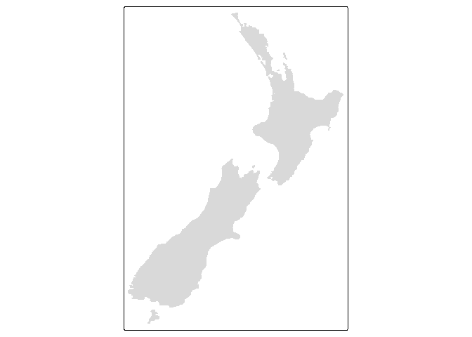<!-- -->

Add border layer to nz shape

``` r
tm_shape(nz) +
    tm_borders() 
```

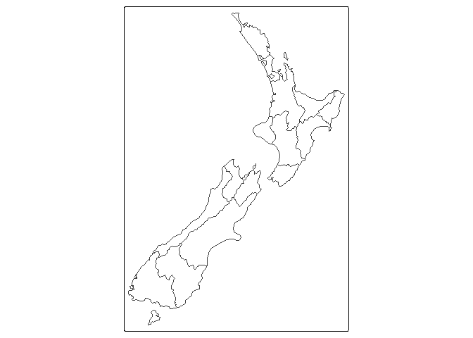<!-- -->

Add fill and border layers to nz shape

``` r
tm_shape(nz) +
    tm_fill() +
    tm_borders() 
```

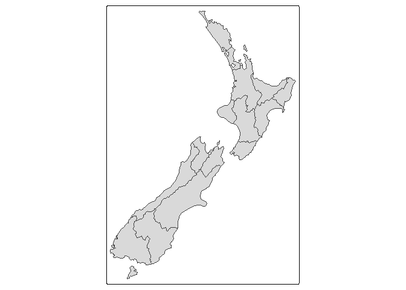<!-- -->

`qtm(nz)` = `tm_shape(nz) + tm_fill() + tm_borders()`

``` r
qtm(nz)
```

<!-- -->

``` r
qtm(nz_height)
```

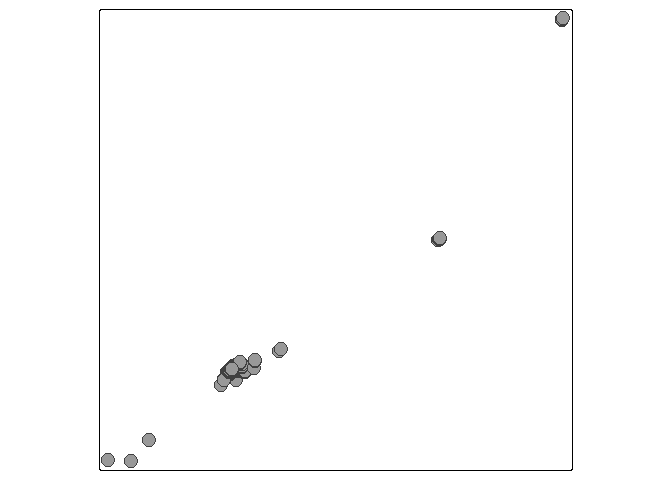<!-- -->

``` r
qtm(nz) + qtm(nz_height)
```

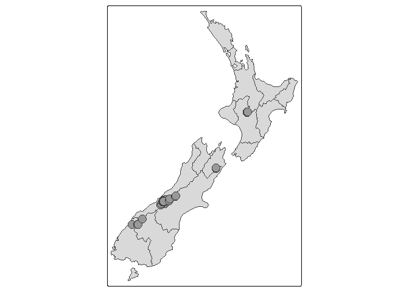<!-- -->

## Map objects

``` r
## map objects #-------------------
(map_nz <- tm_shape(nz) + tm_polygons())
```

<!-- -->

``` r
class(map_nz)
```

    ## [1] "tmap"

``` r
(map_nz1 <- map_nz +
    tm_shape(nz_elev) + 
    tm_raster(col_alpha = 0.7))
```

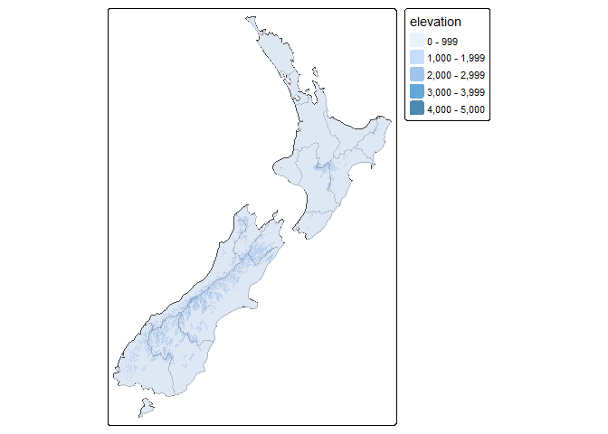<!-- -->

``` r
(nz_water <- st_union(nz) %>% 
    st_buffer(22200) %>% 
    st_cast(to = "LINESTRING"))
```

    ## Geometry set for 1 feature 
    ## Geometry type: LINESTRING
    ## Dimension:     XY
    ## Bounding box:  xmin: 1067944 ymin: 4726340 xmax: 2111732 ymax: 6214066
    ## Projected CRS: NZGD2000 / New Zealand Transverse Mercator 2000

    ## LINESTRING (1074909 4920220, 1074855 4920397, 1...

``` r
(map_nz2 <- map_nz1 +
    tm_shape(nz_water) + 
    tm_lines())
```

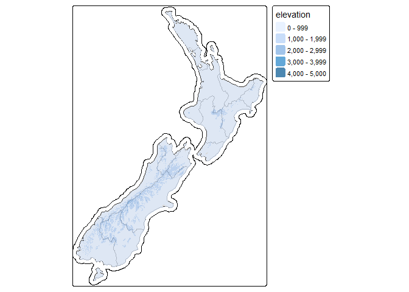<!-- -->

``` r
(map_nz3 = map_nz2 +
    tm_shape(nz_height) + 
    tm_symbols())
```

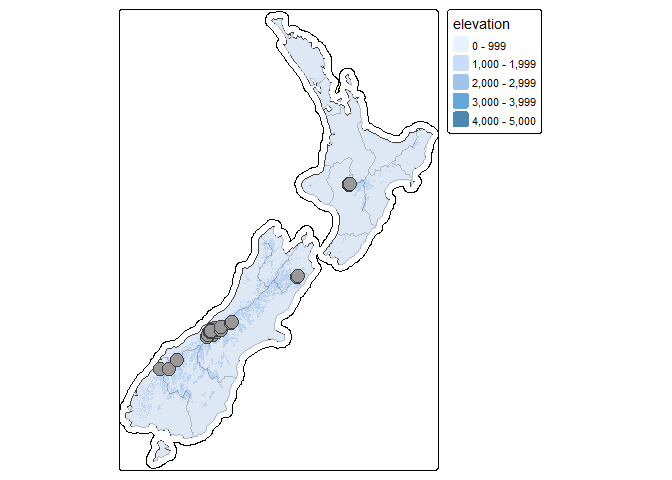<!-- -->

``` r
tmap_arrange(map_nz1, map_nz2, map_nz3)
```

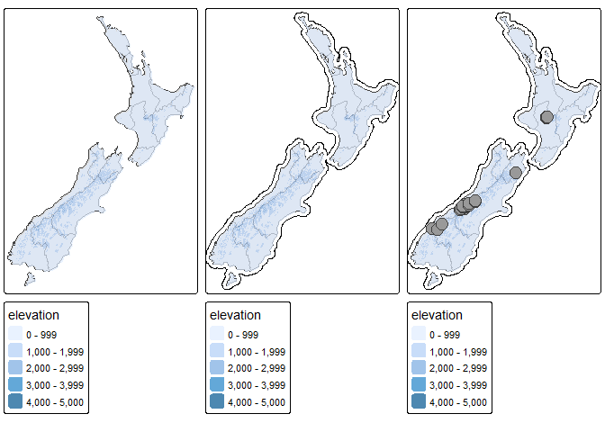<!-- -->

``` r
ma1 = tm_shape(nz) + tm_polygons(fill = "red")
ma2 = tm_shape(nz) + tm_polygons(fill = "red", fill_alpha = 0.3)
ma3 = tm_shape(nz) + tm_polygons(col = "blue")
ma4 = tm_shape(nz) + tm_polygons(lwd = 3)
ma5 = tm_shape(nz) + tm_polygons(lty = 2)
ma6 = tm_shape(nz) + tm_polygons(fill = "red", 
                                 fill_alpha = 0.3,
                                 col = "blue", 
                                 lwd = 3, lty = 2)
tmap_arrange(ma1, ma2, ma3, ma4, ma5, ma6)
```

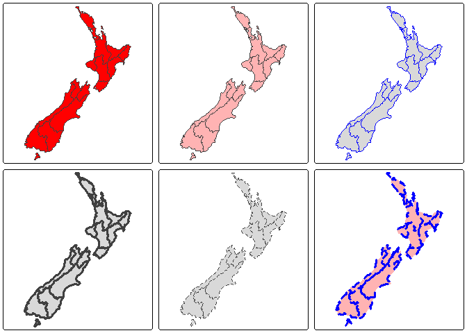<!-- -->

``` r
plot(st_geometry(nz), col = nz$Land_area)
```

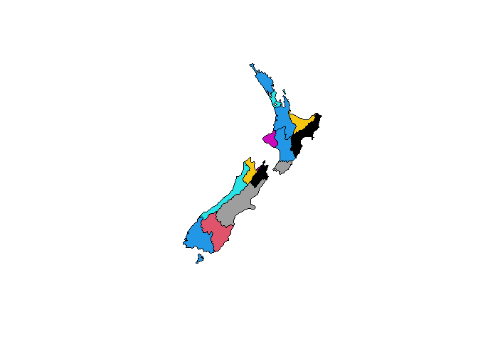<!-- -->

``` r
tm_shape(nz) + tm_fill(fill = "Land_area")
```

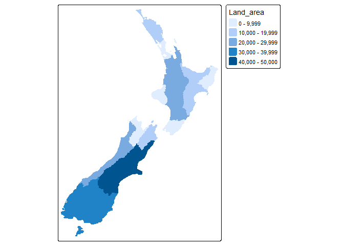<!-- -->

## Scales

``` r
## scales #---------------------
tm_shape(nz) + tm_polygons(fill = "Median_income")
```

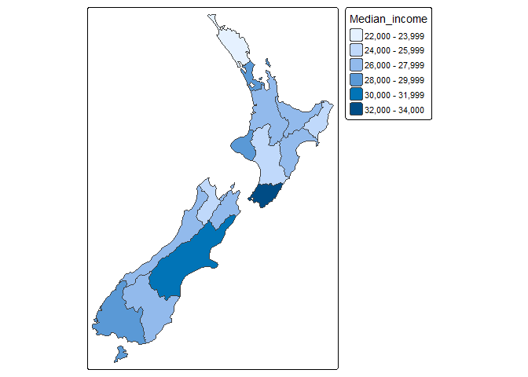<!-- -->

``` r
tm_shape(nz) + tm_polygons(fill = "Median_income",
                           fill.scale = tm_scale(breaks = c(0, 30000, 40000, 50000)))
```

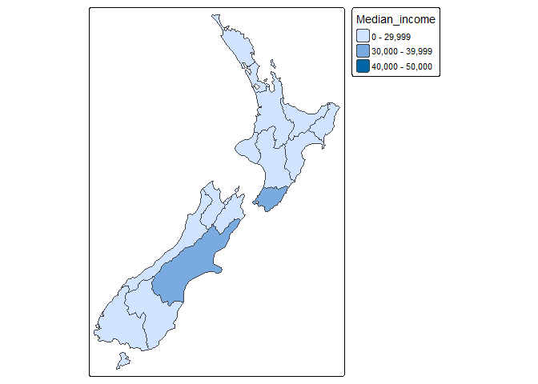<!-- -->

``` r
tm_shape(nz) + tm_polygons(fill = "Median_income",
                           fill.scale = tm_scale(n = 10))
```

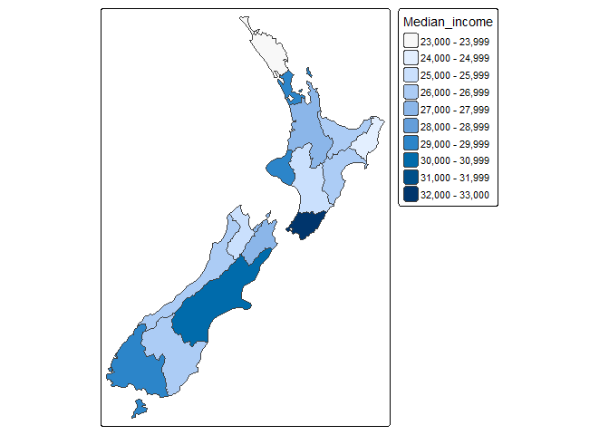<!-- -->

``` r
tm_shape(nz) + tm_polygons(fill = "Median_income",
                           fill.scale = tm_scale(values = "BuGn"))
```

    ## [cols4all] color palettes: use palettes from the R package cols4all. Run `cols4all::c4a_gui()` to
    ## explore them. The old palette name "BuGn" is named "brewer.bu_gn"
    ## Multiple palettes called "bu_gn" found: "brewer.bu_gn", "matplotlib.bu_gn". The first one, "brewer.bu_gn", is returned.

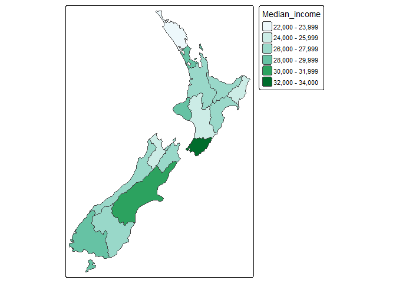<!-- -->

Colors

``` r
tm_shape(nz) + 
    tm_polygons("Median_income", fill.scale = tm_scale(values = "greens"))
```

    ## Multiple palettes called "greens" found: "brewer.greens", "matplotlib.greens". The first one, "brewer.greens", is returned.

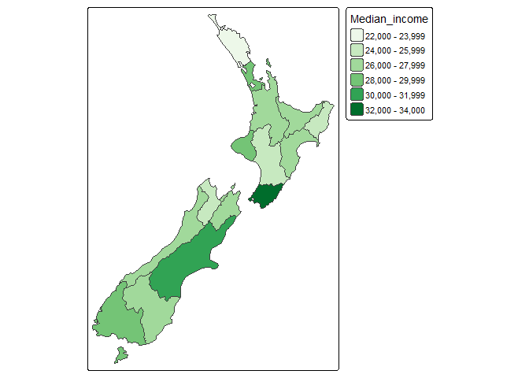<!-- -->

``` r
tm_shape(nz) + 
    tm_polygons("Median_income", fill.scale = tm_scale(values = "yl_gn_bu"))
```

    ## Multiple palettes called "yl_gn_bu" found: "brewer.yl_gn_bu", "matplotlib.yl_gn_bu". The first one, "brewer.yl_gn_bu", is returned.

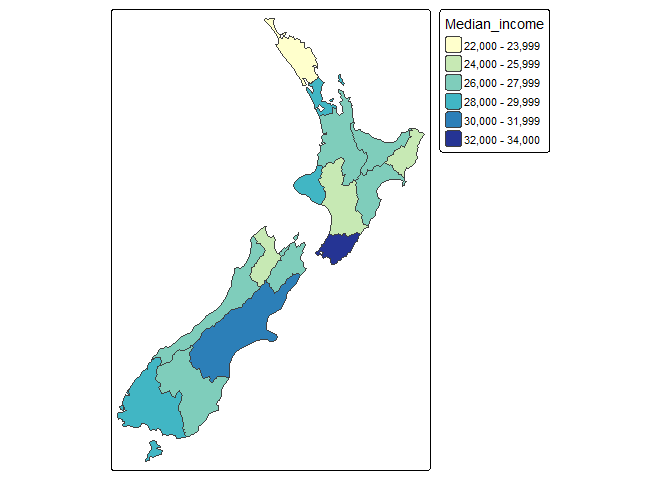<!-- -->

``` r
tm_shape(nz) + 
    tm_polygons("Median_income",
                fill.scale = tm_scale_continuous(values = "pu_gn_div", 
                                                 midpoint = 28000))
```

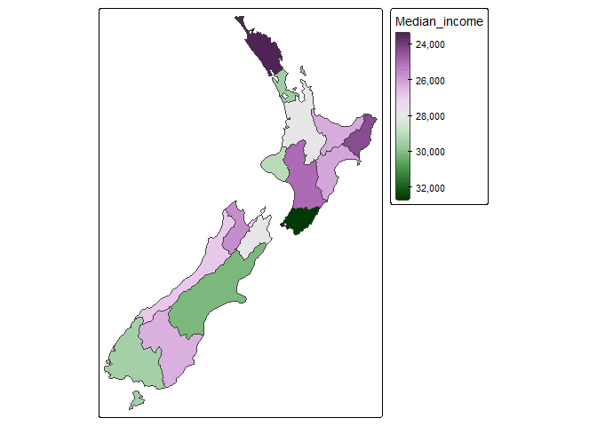<!-- -->

## Legends

``` r
## legends #----------------
legend_title = expression("Area (km"^2*")")
tm_shape(nz) +
    tm_polygons(fill = "Land_area", fill.legend = tm_legend(title = legend_title))
```

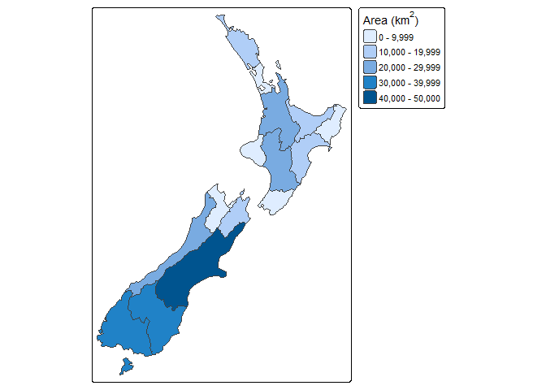<!-- -->

``` r
tm_shape(nz) +
    tm_polygons(fill = "Land_area",
                fill.legend = tm_legend(title = legend_title,
                                        orientation = "landscape",
                                        position = tm_pos_out("center", "bottom")))
```

    ## [plot mode] fit legend/component: Some legend items or map compoments do not fit well, and are
    ## therefore rescaled.
    ## ℹ Set the tmap option `component.autoscale = FALSE` to disable rescaling.

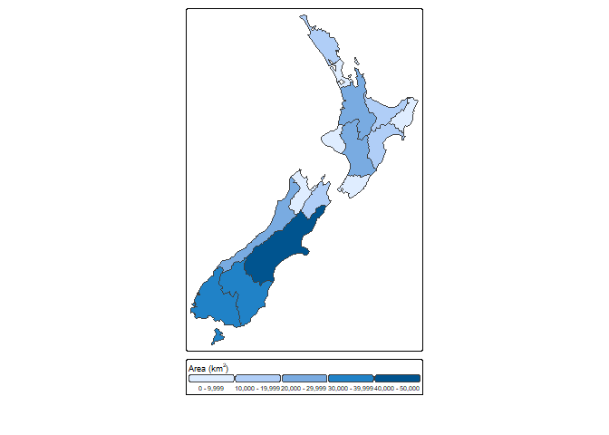<!-- -->

## Layouts

``` r
## layouts #-----------------
map_nz + 
    tm_graticules() +
    tm_compass(type = "8star", position = c("left", "top")) +
    tm_scalebar(breaks = c(0, 100, 200), text.size = 1, position = c("left", "top")) +
    tm_title("New Zealand")
```

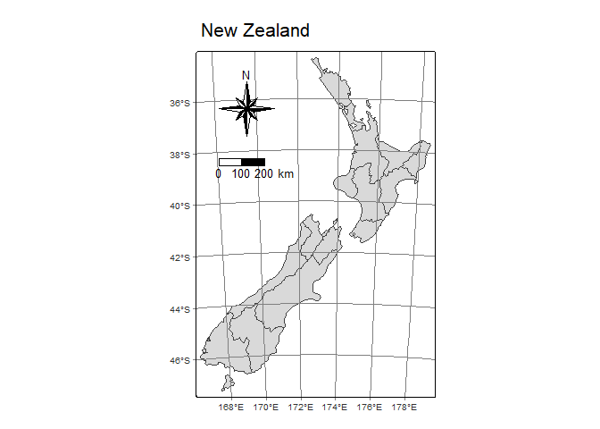<!-- -->

``` r
map_nz + tm_layout(scale = 4)
```

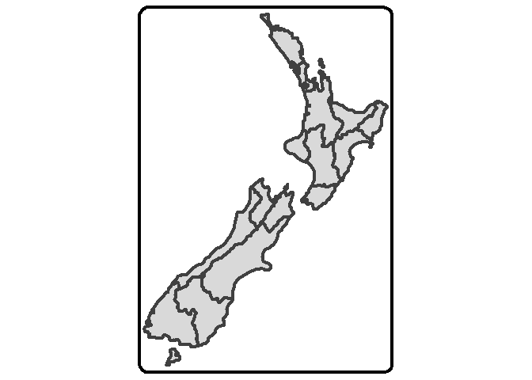<!-- -->

``` r
map_nz + tm_layout(bg.color = "lightblue")
```

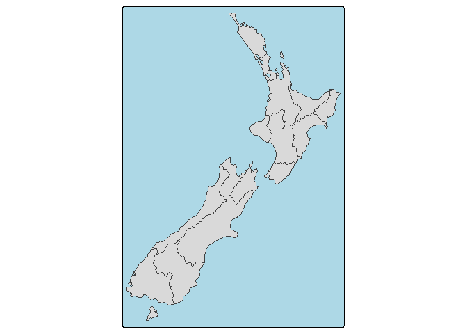<!-- -->

``` r
map_nz + tm_layout(frame = FALSE)
```

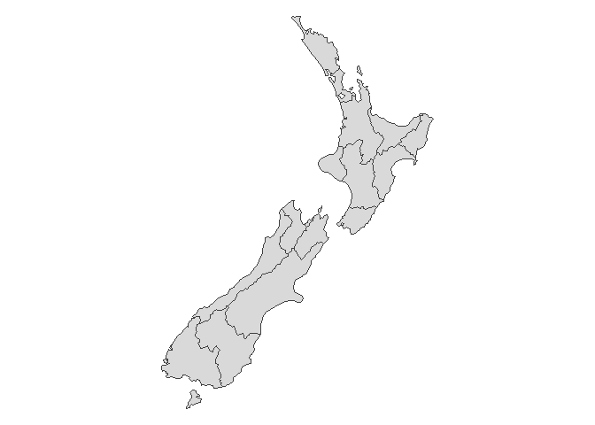<!-- -->

## Facets

``` r
## facets #--------------------
(urb_1970_2030 = urban_agglomerations |> 
    filter(year %in% c(1970, 1990, 2010, 2030)))
```

    ## Simple feature collection with 120 features and 9 fields
    ## Geometry type: POINT
    ## Dimension:     XY
    ## Bounding box:  xmin: -118.2417 ymin: -34.60508 xmax: 139.6917 ymax: 55.755
    ## Geodetic CRS:  WGS 84
    ## # A tibble: 120 × 10
    ##    index  year `rank\norder` `country\ncode` country_or_area city_code urban_agglomeration  note
    ##  * <dbl> <dbl>         <dbl>           <dbl> <chr>               <dbl> <chr>               <dbl>
    ##  1     5  1970             5              32 Argentina           20058 Buenos Aires            1
    ##  2     9  1990             7              32 Argentina           20058 Buenos Aires            1
    ##  3    13  2010            12              32 Argentina           20058 Buenos Aires            1
    ##  4    17  2030            20              32 Argentina           20058 Buenos Aires            1
    ##  5    23  1970            28              50 Bangladesh          20119 Dhaka                   2
    ##  6    27  1990            20              50 Bangladesh          20119 Dhaka                   2
    ##  7    31  2010            11              50 Bangladesh          20119 Dhaka                   2
    ##  8    35  2030             4              50 Bangladesh          20119 Dhaka                   2
    ##  9    41  1970            11              76 Brazil              20272 Rio de Janeiro         NA
    ## 10    45  1990            11              76 Brazil              20272 Rio de Janeiro         NA
    ## # ℹ 110 more rows
    ## # ℹ 2 more variables: population_millions <dbl>, geometry <POINT [°]>

``` r
tm_shape(world) +
    tm_polygons() +
    tm_shape(urb_1970_2030) +
    tm_symbols(fill = "black", col = "white", size = "population_millions") +
    tm_facets_wrap(by = "year", nrow = 2)
```

    ## [tip] Consider a suitable map projection, e.g. by adding `+ tm_crs("auto")`.
    ## This message is displayed once per session.

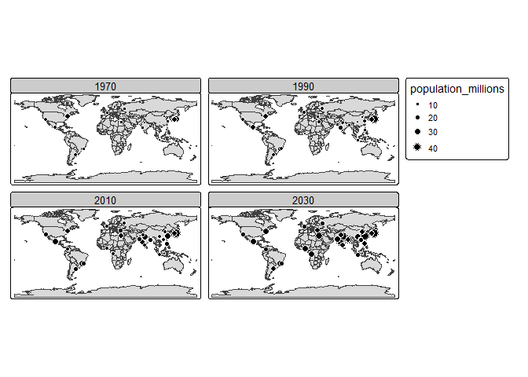<!-- -->

## Inset maps

``` r
## inset #--------------------
```

### New Zealand’s Southern Alps

``` r
### New Zealand #-------------
```

**Step 01**: define the area of interest

``` r
nz_region = st_bbox(c(xmin = 1340000, xmax = 1450000,
                      ymin = 5130000, ymax = 5210000),
                    crs = st_crs(nz_height)) |> 
    st_as_sfc()
nz_region
```

    ## Geometry set for 1 feature 
    ## Geometry type: POLYGON
    ## Dimension:     XY
    ## Bounding box:  xmin: 1340000 ymin: 5130000 xmax: 1450000 ymax: 5210000
    ## Projected CRS: NZGD2000 / New Zealand Transverse Mercator 2000

    ## POLYGON ((1340000 5130000, 1450000 5130000, 145...

**Step 02**: base-map showing New Zealand’s Southern Alps area

``` r
nz_height_map = tm_shape(nz_elev, bbox = nz_region) +
    tm_raster(col.scale = tm_scale_continuous(values = "YlGn"),
              col.legend = tm_legend(position = c("left", "top"))) +
    tm_shape(nz_height) + tm_symbols(shape = 2, col = "red", size = 1) +
    tm_scalebar(position = c("left", "bottom"))
nz_height_map
```

    ## [cols4all] color palettes: use palettes from the R package cols4all. Run `cols4all::c4a_gui()` to
    ## explore them. The old palette name "YlGn" is named "brewer.yl_gn"

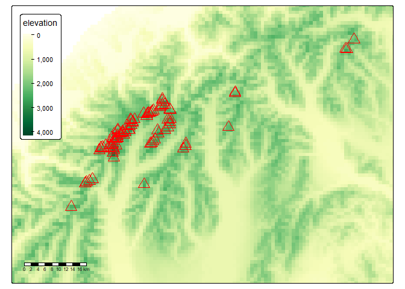<!-- -->

**Step 03**: create inset map

``` r
nz_map = tm_shape(nz) + tm_polygons() +
    tm_shape(nz_height) + tm_symbols(shape = 2, col = "red", size = 0.1) + 
    tm_shape(nz_region) + tm_borders(lwd = 3) +
    tm_layout(bg.color = "lightblue")
nz_map
```

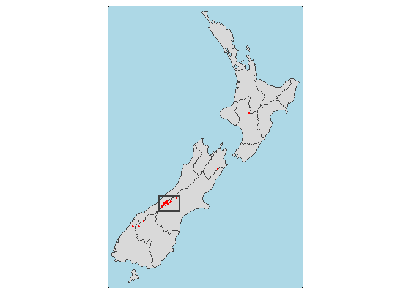<!-- -->

**Step 04**: calculate the aspect ratios of two main datasets

``` r
norm_dim = function(obj){
    bbox = st_bbox(obj)
    width = bbox[["xmax"]] - bbox[["xmin"]]
    height = bbox[["ymax"]] - bbox[["ymin"]]
    w = width / max(width, height)
    h = height / max(width, height)
    return(unit(c(w, h), "snpc"))
}

(main_dim = norm_dim(nz_region))
```

    ## [1] 1snpc                 0.727272727272727snpc

``` r
(ins_dim = norm_dim(nz))
```

    ## [1] 0.692415525673754snpc 1snpc

**Step 05**: pecify the sizes and locations of two maps

``` r
main_vp = viewport(width = main_dim[1], height = main_dim[2])

# make the inset map twice smaller as the main
ins_vp = viewport(width = ins_dim[1] * 0.5, height = ins_dim[2] * 0.5,
                  x = unit(1, "npc") - unit(0.5, "cm"), y = unit(0.5, "cm"),
                  just = c("right", "bottom"))
```

**Step 06**: combine two maps

``` r
grid.newpage()
print(nz_height_map, vp = main_vp)
```

    ## [cols4all] color palettes: use palettes from the R package cols4all. Run `cols4all::c4a_gui()` to
    ## explore them. The old palette name "YlGn" is named "brewer.yl_gn"

``` r
pushViewport(main_vp)
print(nz_map, vp = ins_vp)
```

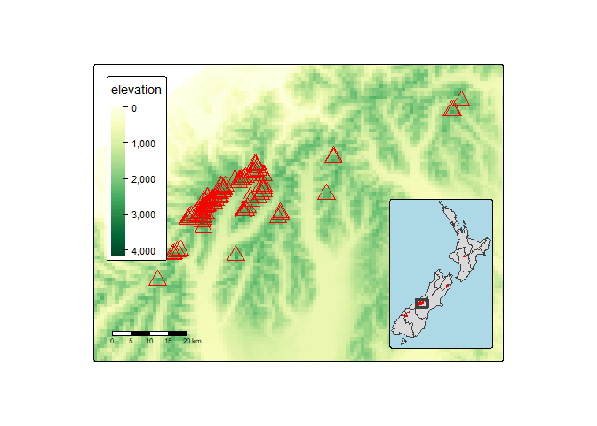<!-- -->

**Step 07**: save the map

``` r
# tmap_save()
```

### United States

``` r
### United States #-------------
```

US map

``` r
us_states_map = tm_shape(us_states, crs = "EPSG:9311") + 
    tm_polygons() + 
    tm_layout(frame = FALSE)
us_states_map
```

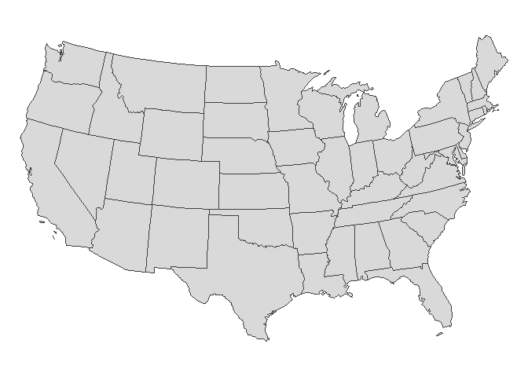<!-- -->

Hawaii map

``` r
hawaii_map = tm_shape(hawaii) +
    tm_polygons() + 
    tm_title("Hawaii") +
    tm_layout(frame = FALSE, bg.color = NA, 
              title.position = c("LEFT", "BOTTOM"))
hawaii_map
```

    ## → [layout options] use `bg = FALSE` instead of `bg.color = NA`

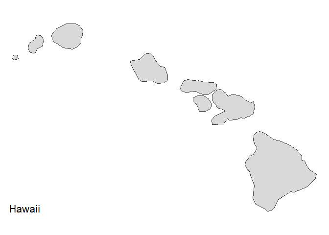<!-- -->

Alaska map

``` r
alaska_map = tm_shape(alaska) +
    tm_polygons() + 
    tm_title("Alaska") +
    tm_layout(frame = FALSE, bg.color = NA)
alaska_map
```

    ## → [layout options] use `bg = FALSE` instead of `bg.color = NA`

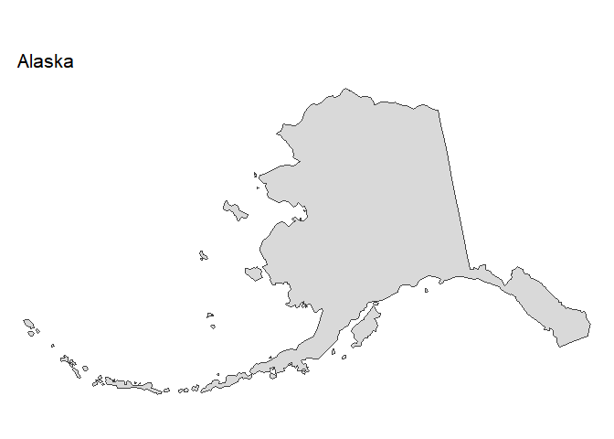<!-- -->

Combine maps

``` r
us_states_map
print(hawaii_map, vp = grid::viewport(0.35, 0.1, width = 0.2, height = 0.1))
```

    ## → [layout options] use `bg = FALSE` instead of `bg.color = NA`

``` r
print(alaska_map, vp = grid::viewport(0.15, 0.15, width = 0.3, height = 0.3))
```

    ## → [layout options] use `bg = FALSE` instead of `bg.color = NA`

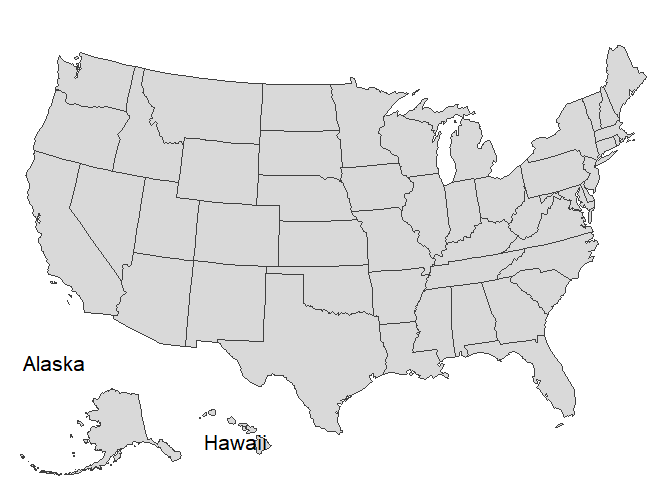<!-- -->

# Animated maps

``` r
# animated maps #-----------
urb_anim = tm_shape(world) + tm_polygons() + 
    tm_shape(urban_agglomerations) + tm_symbols(size = "population_millions") +
    tm_facets_wrap(by = "year", nrow = 1, ncol = 1, free.coords = FALSE)

tmap_animation(urb_anim,
               filename = here("geo_computation/chap09/urb_anim.gif"),
               delay = 25)
```

    ## [`tmap_animation()`] please specify the frames per second `fps` in `tm_animate()`

    ## Creating frames

    ## 
    ## Creating animation
    ## Animation saved to G:\My Drive\git\note_geo_computation\geo_computation\chap09\urb_anim.gif


# Interactive maps

``` r
# interactive maps #-----------
```

## `tmap::tmap_mode("view")`

``` r
## tmap::tmap_mode("view") #---------

# tmap::tmap_mode("view")
# 
# map_nz
# 
# alaska_map
```

`tmap::tmap_leaflet()`

``` r
# map_nz + tm_basemap(server = "OpenTopoMap")
# 
# (world_coffee = left_join(world, coffee_data, by = "name_long"))
# facets = c("coffee_production_2016", "coffee_production_2017")
# tm_shape(world_coffee) + 
#     tm_polygons(facets) + 
#     tm_facets_wrap(nrow = 1, sync = TRUE)
```

Switch back to plotting mode

``` r
tmap::tmap_mode("plot")
```

    ## ℹ tmap modes "plot" - "view"
    ## ℹ toggle with `tmap::ttm()`

## `mapview::mapview()`

``` r
## mapview::mapview() #---------
# mapview::mapview(nz)

# oberfranken = subset(franconia, district == "Oberfranken")
# trails |>
#     st_transform(st_crs(oberfranken)) |>
#     st_intersection(oberfranken) |>
#     st_collection_extract("LINESTRING") |>
#     mapview(color = "red", lwd = 3, layer.name = "trails") +
#     mapview(franconia, zcol = "district") +
#     breweries
```
