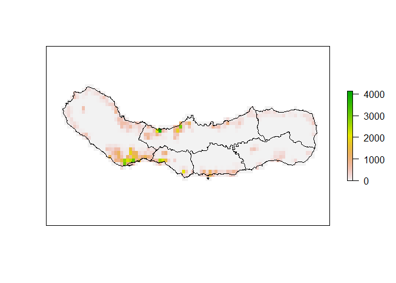
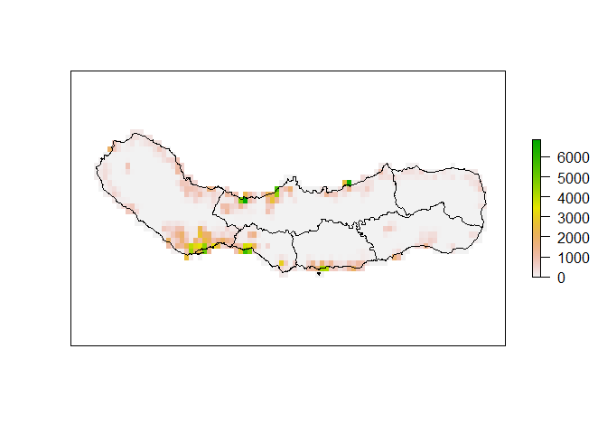
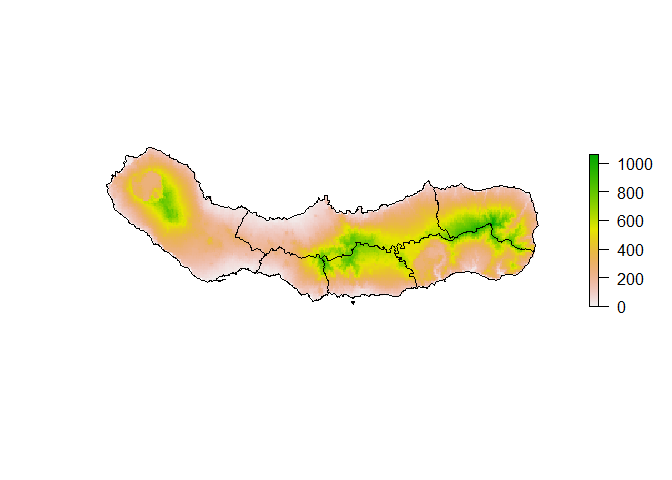

Summarizing gridded population data
================

``` r
pacman::p_load(
    rio,            # import and export files
    here,           # locate files 
    tidyverse,      # data management and visualization
    exactextractr,
    raster,
    sf
)
```

[Summarizing gridded population
data](https://isciences.gitlab.io/exactextractr/articles/vig1_population.html)  
- Region: São Miguel, the largest and most populous island of the Azores
archipelago.  
- Population data: [Gridded Population of the
World](https://www.earthdata.nasa.gov/data/projects/gpw)  
- Elevation data:
[EU-DEM](https://www.eea.europa.eu/data-and-maps/data/copernicus-land-monitoring-service-eu-dem)  
**Note:** six *concelhos* = six municipalities

``` r
#---
```

# Data

``` r
# data #-----------
```

## Geographical boundary

``` r
concelhos <- st_read(system.file('sao_miguel/concelhos.gpkg',
                                 package = 'exactextractr'),
                     quiet = TRUE)
concelhos
```

    ## Simple feature collection with 6 features and 1 field
    ## Geometry type: MULTIPOLYGON
    ## Dimension:     XY
    ## Bounding box:  xmin: -25.85502 ymin: 37.70293 xmax: -25.13465 ymax: 37.90969
    ## Geodetic CRS:  WGS 84
    ##                   name                           geom
    ## 1                Lagoa MULTIPOLYGON (((-25.49621 3...
    ## 2             Nordeste MULTIPOLYGON (((-25.14147 3...
    ## 3        Ponta Delgada MULTIPOLYGON (((-25.63204 3...
    ## 4             Povoação MULTIPOLYGON (((-25.14147 3...
    ## 5       Ribeira Grande MULTIPOLYGON (((-25.43869 3...
    ## 6 Vila Franca do Campo MULTIPOLYGON (((-25.44345 3...

## Population data

Count data

``` r
pop_count <- raster(system.file('sao_miguel/gpw_v411_2020_count_2020.tif',
                                package = 'exactextractr'))
pop_count
```

    ## class      : RasterLayer 
    ## dimensions : 48, 96, 4608  (nrow, ncol, ncell)
    ## resolution : 0.008333333, 0.008333333  (x, y)
    ## extent     : -25.9, -25.1, 37.6, 38  (xmin, xmax, ymin, ymax)
    ## crs        : +proj=longlat +datum=WGS84 +no_defs 
    ## source     : gpw_v411_2020_count_2020.tif 
    ## names      : gpw_v411_2020_count_2020

``` r
plot(pop_count, axes = FALSE)
plot(st_geometry(concelhos), add = TRUE)
```

<!-- -->

Density data: number of persons per square kilometer of land area in
each pixel

``` r
pop_density <- raster(system.file('sao_miguel/gpw_v411_2020_density_2020.tif',
                                  package = 'exactextractr'))
pop_density
```

    ## class      : RasterLayer 
    ## dimensions : 48, 96, 4608  (nrow, ncol, ncell)
    ## resolution : 0.008333333, 0.008333333  (x, y)
    ## extent     : -25.9, -25.1, 37.6, 38  (xmin, xmax, ymin, ymax)
    ## crs        : +proj=longlat +datum=WGS84 +no_defs 
    ## source     : gpw_v411_2020_density_2020.tif 
    ## names      : gpw_v411_2020_density_2020

``` r
plot(pop_density, axes = FALSE)
plot(st_geometry(concelhos), add = TRUE)
```

<!-- -->

## Elevation data

``` r
elev <- raster(system.file('sao_miguel/eu_dem_v11.tif',
                           package = 'exactextractr'))
elev
```

    ## class      : RasterLayer 
    ## dimensions : 192, 384, 73728  (nrow, ncol, ncell)
    ## resolution : 0.002083333, 0.002083333  (x, y)
    ## extent     : -25.9, -25.1, 37.6, 38  (xmin, xmax, ymin, ymax)
    ## crs        : +proj=longlat +datum=WGS84 +no_defs 
    ## source     : eu_dem_v11.tif 
    ## names      : Band_1

``` r
plot(elev, axes = FALSE, box = FALSE)
plot(st_geometry(concelhos), add = TRUE)
```

<!-- -->

=\> Population data and elevation data have different resolutions

``` r
#---
```

# Calculate population

``` r
# calculate population #-----------------------
```

## Total population

``` r
cellStats(pop_count, 'sum')
```

    ## [1] 145603

## From population count file

``` r
exact_extract(x = pop_count,
              y = concelhos, 
              fun = 'sum',
              progress = FALSE)
```

    ## [1] 14539.875  4149.851 66866.711  5293.968 31920.496  9093.449

``` r
exact_extract(x = pop_count,
              y = concelhos, 
              fun = 'sum',
              append_cols = "name",
              progress = FALSE)
```

    ##                   name       sum
    ## 1                Lagoa 14539.875
    ## 2             Nordeste  4149.851
    ## 3        Ponta Delgada 66866.711
    ## 4             Povoação  5293.968
    ## 5       Ribeira Grande 31920.496
    ## 6 Vila Franca do Campo  9093.449

``` r
exact_extract(x = pop_count,
              y = concelhos, 
              fun = 'sum',
              append_cols = "name",
              progress = FALSE) %>% 
    janitor::adorn_totals()
```

    ##                  name        sum
    ##                 Lagoa  14539.875
    ##              Nordeste   4149.851
    ##         Ponta Delgada  66866.711
    ##              Povoação   5293.968
    ##        Ribeira Grande  31920.496
    ##  Vila Franca do Campo   9093.449
    ##                 Total 131864.350

Total population = 131864 \< 145603  
→ 9% of the population is unaccounted for in the concelho totals.  
→ in southern coast, many cells are only partially covered by the
concelho boundaries.

``` r
#---
```

## From population density file

population count = population density x area of each cell

``` r
exact_extract(pop_density,
              concelhos, 
              function(density, frac, area) {
                  sum(density * frac * area)
              }, 
              weights = raster::area(pop_density),
              append_cols = 'name',
              progress = FALSE) %>% 
    janitor::adorn_totals()
```

    ##                  name     result
    ##                 Lagoa  15702.111
    ##              Nordeste   4512.718
    ##         Ponta Delgada  70982.133
    ##              Povoação   5964.685
    ##        Ribeira Grande  35934.772
    ##  Vila Franca do Campo  11704.244
    ##                 Total 144800.665

Limitation: pre-compute an area raster → store it in memory → load all
raster values intersecting a given polygon into memory at a single time.

``` r
# Solution: recommended!!!
exact_extract(x = pop_density,
              y = concelhos,
              fun = 'weighted_sum',
              weights = 'area',
              append_cols = 'name',
              progress = FALSE) %>% 
    janitor::adorn_totals()
```

    ##                  name weighted_sum
    ##                 Lagoa  15788098560
    ##              Nordeste   4537404928
    ##         Ponta Delgada  71370694656
    ##              Povoação   5997344256
    ##        Ribeira Grande  36131401728
    ##  Vila Franca do Campo  11768353792
    ##                 Total 145593297920

# Population-weighted statistics

``` r
# population-weighted estimate #----------------------
```

Calculate the average elevation of a residence in each of the six
concelhos.  
Assume all pixel areas to be equivalent

``` r
exact_extract(x = elev,
              y = concelhos,
              fun = 'weighted_mean',
              weights = pop_density,
              append_cols = 'name',
              progress = FALSE)
```

    ##                   name weighted_mean
    ## 1                Lagoa      76.87473
    ## 2             Nordeste     192.47075
    ## 3        Ponta Delgada      97.73951
    ## 4             Povoação     170.46439
    ## 5       Ribeira Grande      74.84976
    ## 6 Vila Franca do Campo      92.20575

Pixel areas vary across the region

``` r
exact_extract(x = elev,
              y = concelhos,
              function(df) {
                  weighted.mean(x = df$value,
                                w = df$coverage_fraction * df$pop_density * df$area,
                                na.rm = TRUE)},
              weights = stack(list(pop_density = pop_density,
                                   area = area(pop_density))),
              summarize_df = TRUE,
              progress = FALSE,
              append_cols = 'name')
```

    ##                   name    result
    ## 1                Lagoa  76.87347
    ## 2             Nordeste 192.47475
    ## 3        Ponta Delgada  97.71885
    ## 4             Povoação 170.45423
    ## 5       Ribeira Grande  74.84939
    ## 6 Vila Franca do Campo  92.20172

Limitation: pre-compute an area raster → store it in memory → load all
raster values intersecting a given polygon into memory at a single time.

``` r
# Solution: recommended!!!
```

`coverage_area = TRUE`: all calculations use the area of each cell that
is covered by the polygon instead of the fraction of each cell that is
covered by the polygon

``` r
exact_extract(elev,
              concelhos,
              c('mean', 'weighted_mean'),
              weights = pop_density,
              coverage_area = TRUE, 
              append_cols = 'name',
              progress = FALSE)
```

    ##                   name     mean weighted_mean
    ## 1                Lagoa 233.7098      76.87321
    ## 2             Nordeste 453.8504     192.47522
    ## 3        Ponta Delgada 274.4062      97.71867
    ## 4             Povoação 375.4573     170.45435
    ## 5       Ribeira Grande 312.0619      74.84953
    ## 6 Vila Franca do Campo 418.7338      92.20170
